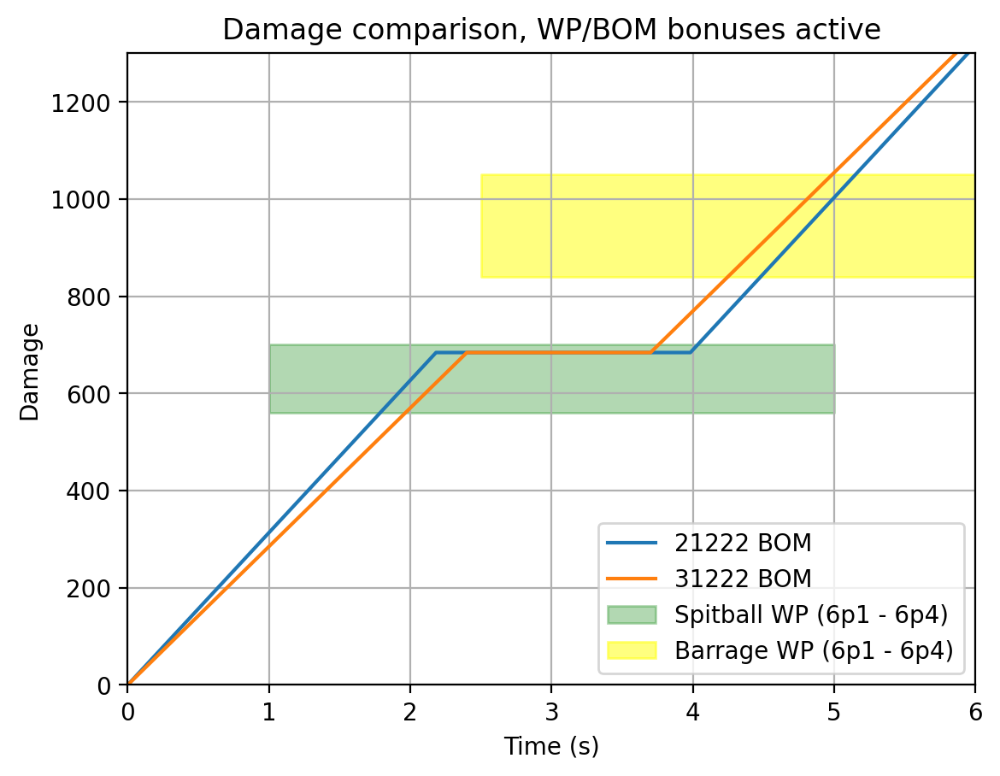
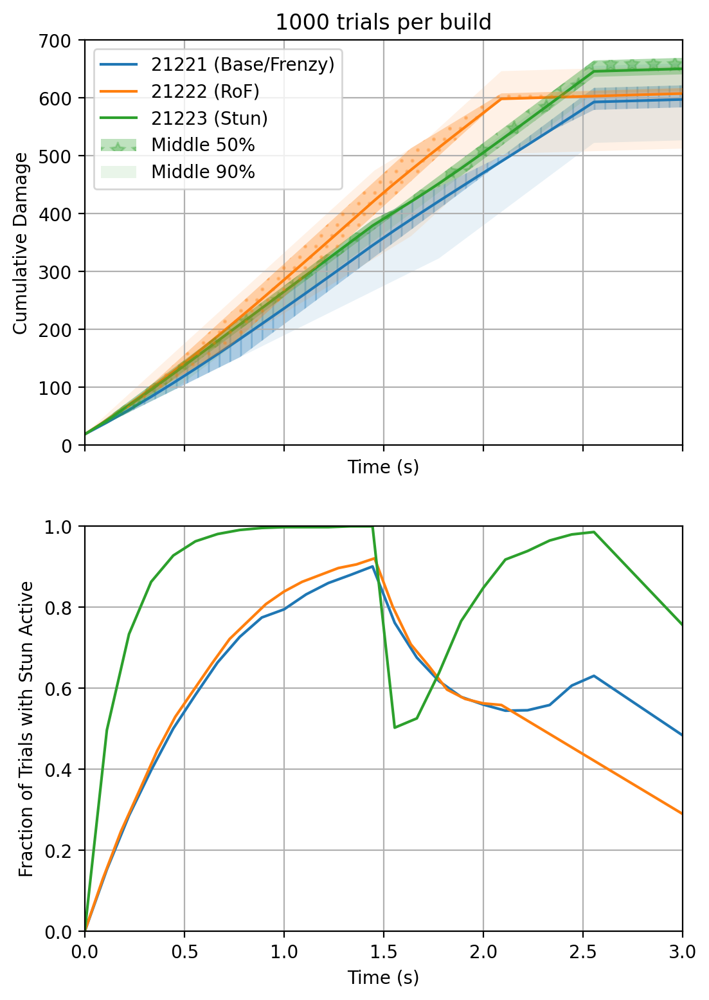
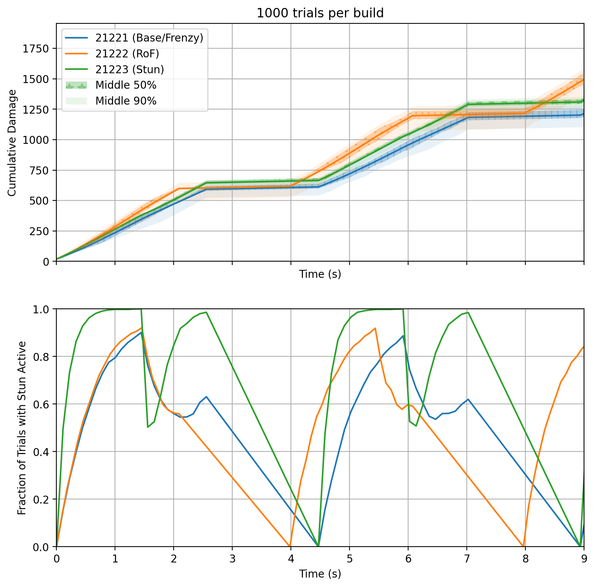
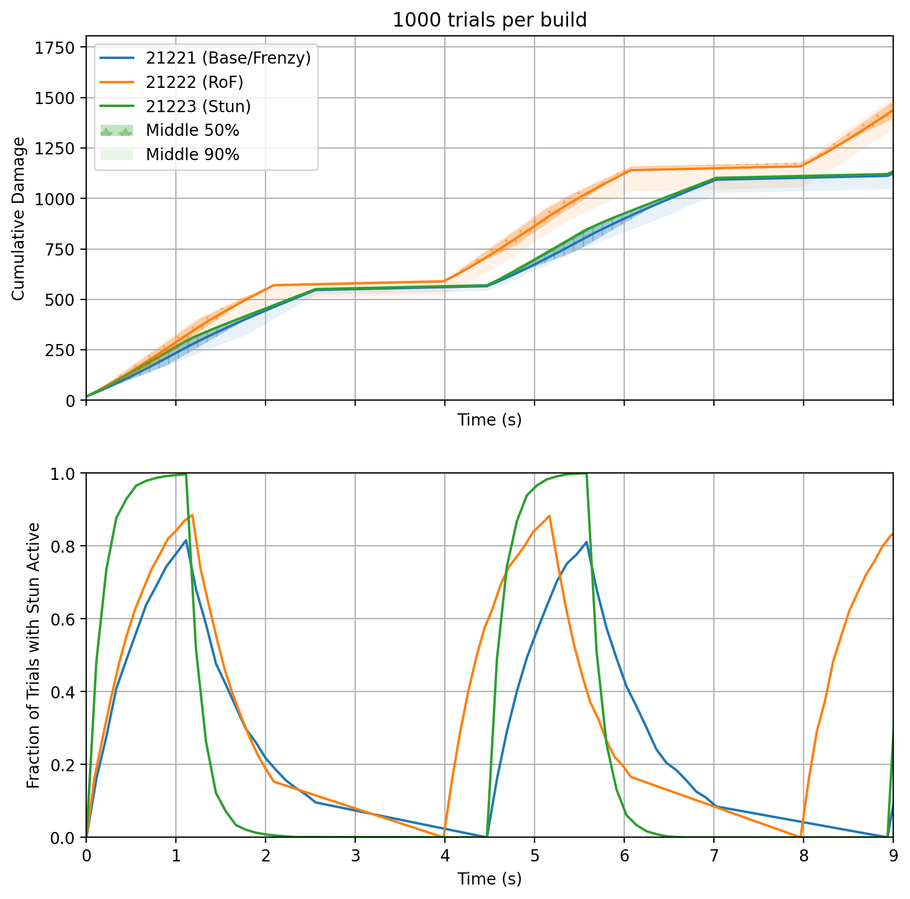

[DRG Analysis](README.md) > **Bullets of Mercy and the stun upgrade**

# Bullets of Mercy and the stun upgrade

## Introduction

Bullets of Mercy (BoM or BOM) is an overclock for the GK2 that gives a x1.5 damage bonus against enemies if they have at least one status effect applied. For the list of eligible status effects, see [SplitSentro's status effects spreadsheet](https://docs.google.com/spreadsheets/d/1Cpj5BACrJ8psgqWeCbKd6CrWsIr4wXHnFRrjVzrlc1U/edit?usp=sharing). In exchange, the magazine size is reduced.

This used to be pretty widely considered the top overclock for the GK2, but eventually AI Stability Engine (AISE) got buffed. It was also later discovered that Overclocked Firing Mechanism (OFM) had been kinda slept on.

For a comparison of these and a few other scout primary options, see this graph:

AI Stability Engine is a bit less bursty, but can spit out more damage before reloading. Fully bonus'd up BOM is the most bursty of the options shown, though in practice is likely to lag behind [Thermal Exhaust Feedback Drak](tef_analysis.md) against many enemies.

## Building BoM

* Tier 1: Accuracy, rate of fire, and reload speed. Accuracy tends to not make a huge difference. The most popular pick seems to be rate of fire for the DPS increase, but reload speed is also notable because the GK2 doesn't have a good reload cancel, and Bullets of Mercy has to reload often because of the magsize penalty. Reload speed pulls ahead of the rate of fire upgrade in sustained DPS after the first reload.
* Tier 2: Damage vs ammo. Both increase your total potential damage output. Damage gives you +19% DPS and +19% total damage, while ammo gives +0% DPS and +31% total damage (if you take t3 magsize). The usual recommendation is damage.
* Tier 3: Recoil vs magazine size. The recoil upgrade secretly also decreases max bloom by 44% but it's still ok to manage without. The magsize upgrade, on the other hand, is desperately needed.
* Tier 4: Weakpoint vs armor break. Armor break is very useful and widens your effective target pool. If your secondary or teammates can deal with armored enemies though, the weakpoint upgrade is another x1.2 damage and ammo efficiency boost. Which one is better depends on what you plan to shoot.
* Tier 5: See next section.

Below: Tier 1 rate of fire vs relolad speed.

## The stun upgrade

Stun is eligible for activating the Bullets of Mercy bonus. The GK2 itself has a natural 15% chance per weakpoint shot to stun an enemy for 1.5 seconds, and there is a tier 5 upgrade that increases this chance to 50% per weakpoint shot. Note that stun cannot be refreshed until after it wears off, and the shot that inflicts stun does not get the bonus.

Because stun is an easy way to activate the 50% damage bonus of Bullets of Mercy, it is popular to recommend the weakpoint stun upgrade in tier 5. However, there is fierce competition in this tier:
* T5A: Battle Frenzy grants two bonuses upon killing something with the weapon: essentially perfect accuracy, and a huge 50% movement speed boost. Both last  for 2.5 seconds and are extremely useful. Accuracy needs no explanation and the speed boost is a powerful kiting and stationary-dodging tool, enabling more weapon uptime and thereby increased killing power.
* T5B is a +2 rate of fire upgrade. This takes your rate of fire from 8 to 10, or 9 to 11 depending on whether you also have the T1B rate of fire upgrade. It's a big DPS increase.
* T5C is the weakpoint stun upgrade.

Let's see what the stun upgrade gets you. I ran a Monte Carlo simulation with each tier 5 option, assuming the BoM bonus only comes from the GK2's weakpoint stun.

Zoomed out:

Assumptions:
* Shots always hit weakpoint
* Target is stunnable and has no stun resistance
* Target has no other BoM-activating status

Takeaways:
* Upgrading stun does slightly increase average DPS, but not by as much as one might expect. It does, however, remove the "unlucky tail" of low damage possibilities where you get bad stun rolls over and over.
* The stun upgrade is super consistent in both damage and stun potential, and can give you safety/efficiency against mactera in particular. 
* The rate of fire upgrade gets you the most theoretical average DPS (a bigger increase than the stun upgrade) but it's less consistent, and there's a small chance of doing worse than the stun upgrade. 
* The advantages of battle frenzy are not the kind that show up in this graph, so remember that they also exist.

Notes:
* If you plan to mostly shoot stationary enemies (which may be the case in some difficulties/team comps), remember that stationaries are not stunnable and the other two t5 upgrades are in that case strictly better. 
* The stun graph appears to trail off linearly during reloads. That's an interpolation artifact.

## Bonus: Stun resistance and cooldown

Several stunnable enemies have *stun resistance*, which decreases their stun duration. For example, praetorians are only stunned for x0.8 as long as usual enemies. Other notable examples are mactera spawn (x0.7), and goo bombers/sentinels (x0.5).

Several stunnable enemies have a *stun cooldown*, which activates when they recover from stun and makes them temporarily immune to being stunned again.  Notable examples are praetorians, guards, stingtails, and sentinels (all have 2 second immunity).

Praetorian example:

[Back to DRG Analysis](README.md)