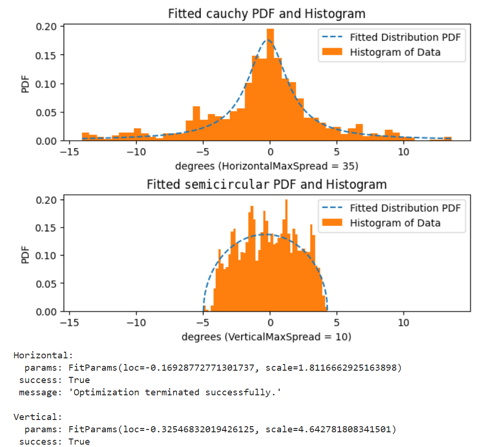
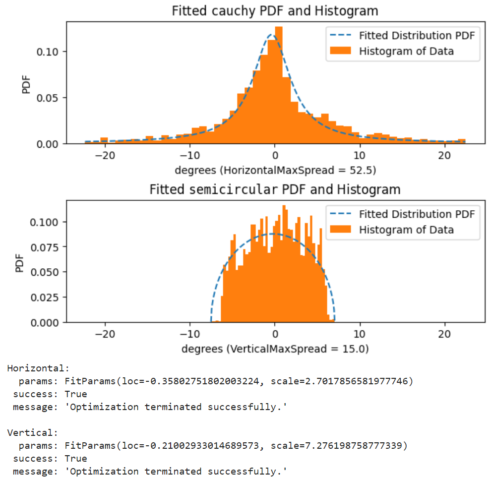
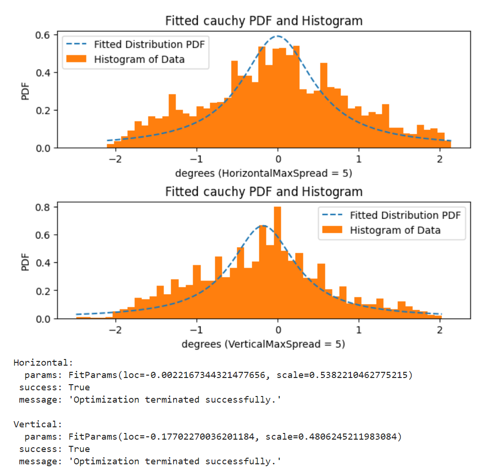
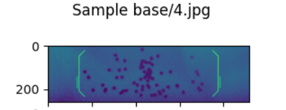
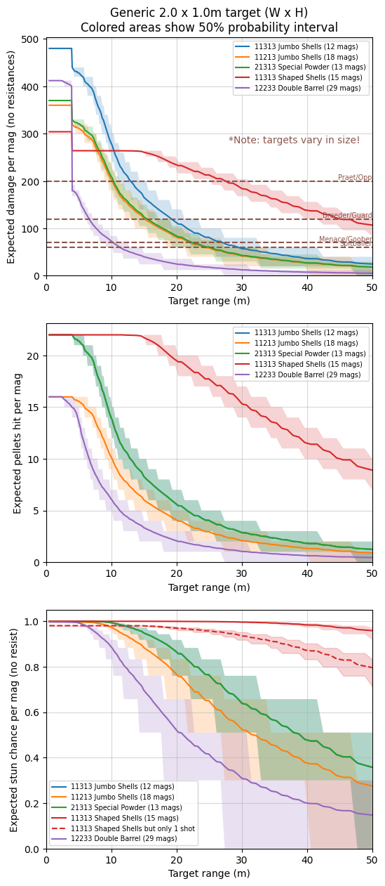
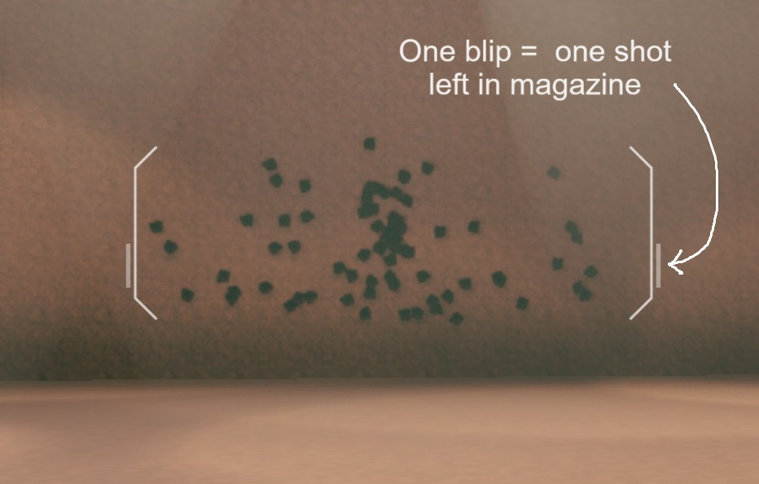

[DRG Analysis](README.md) > **Boomstick Analysis**

> This is also available as [a post on r/technicaldrg](https://www.reddit.com/r/technicaldrg/comments/1c4txtr/build_breakdown_scouts_juryrigged_boomstick/).

# Intro

The Jury-Rigged Boomstick is a strong secondary weapon in both solo and team gameplay. It provides a burst of damage and utility on demand, combining raw damage, ignition, stun, blowthrough, and ranged effectiveness into a single, flexible, instant package.

The main use cases of the boomstick are substantially different in team versus solo play. 

**In solo**, the boomstick is an important source of AOE damage which is lacking in many of Scout's primary weapons. If you want to clear bugs in solo, the boomstick will let you do it - and with fire spreading between densely grouped bugs, horde clear can be achieved with surprising ammo efficiency. You can also use the boomstick to instantly ignite Praetorian gas clouds for a big burst of AOE fire and ignition. Fire Bolts fill a similar solo niche, and are easier to get firespread value with, but lack the same AOE stun and burst damage. The boomstick also offers Scout's best *instant* group killing tool in the Double Barrel overclock, which we will touch on later.

**In teams**, a general rule is that the job of horde clear can be done much more quickly and ammo-efficiently by the rest of the team. Therefore, while you can still use the boomstick to get a few bugs off of you, its main role is substantially different. In general teamplay, it can help chunk down the most dangerous enemies, while providing instant relief in the form of stun. But there's an even more powerful use. Despite the boomstick's seemingly wide spread pattern, it can ignite some enemies at surprisingly long distances. This allows for a simple and devastating teamwork tactic where you light up an enemy, and your [Volatile Bullets](https://www.reddit.com/r/technicaldrg/comments/vbvjuz/build_breakdown_volatile_bullets_gunners_bulldog/) gunner promptly obliterates it. Frequent targets for this strategy include Spitballers, Breeders, Menaces, and Goo Bombers, though of course it is [not limited to those](https://www.reddit.com/r/technicaldrg/comments/wh2myi/volatile_bullets_elephant_rounds_breakpoints/).

**What, specifically, does the boomstick do?** When you pull the trigger, you get a spray of hitscan pellets in a random spread. With a good build, these pellets will penetrate through several enemies and deal Kinetic damage, Fire damage, and Heat to all of them. (The heat will apply even through heavy armor, which blocks other damage types). Each pellet has an independent 30% chance to stun on hit. You also get a small "shockwave", which is a burst of Explosive area damage in a modest area in front of you - good for popping groups of Swarmers. The shockwave area covers a pill shape, where the rounded tip of the pill extends out to 4m in front of you, and the diameter is 3m. It ignores armor and has no falloff.

# Build breakdown

The standard boomstick builds tend to look like X1X13. There are a number of resources already around to explain why these are taken, but I'll explain things again here for completeness.

## Go-to upgrades

- **T2a: Double Trigger** lets you dump both shots quickly, letting you get in and out faster and have a better chance of stunning an enemy sooner. This makes it usually preferable. Besides, you don't always need more than two shots in a short time. When firing quickly, your second shot will be displaced upward by recoil, so at long range you may want to either learn to compensate, or slow down to recover from the recoil between shots. At close range, however, you can just mash out both shots and hit totally fine without particular effort. This upgrade is less essential than the next two.
  - *Exception: Since Double Barrel only has one shot per magazine, Double Trigger is useless and Quickfire Ejector is always better for it.*
- **T4a: Super Blowthrough Rounds** provides a ton of value, letting you stun, ignite, and damage many more enemies much faster and more ammo efficiently. Fire spreads much better when multiple enemies are burning in a small area. Blowthrough also prevents your targets from being able to hide behind other bugs. 
  - *Exception: Since Double Barrel gives an extreme blast wave buff, it usually takes the Blast Wave upgrade instead. Plus, its bigger spread makes the pellets worse at hitting enemies anyway.*
  - *Exception: Since Shaped Shells is specialized into long range single-target instead of close range swarm clear, it is uniquely able to benefit from Armor Break without missing Blowthrough as much as other builds.*
- **T5c: White Phosphorus Shells** changes half of the damage to Fire, which increases your effectiveness against fire-weak enemies such as Mactera and Spitballers. And of course, there's the power of ignition for firespread and Volatile Bullets synergy. A no-brainer.

## Actual upgrade choices

- **Tier 1: A simple choice of ammo (1) versus damage (2).** Note that T1 ammo gives less than T3 ammo, and T1 damage is weaker than T3 pellets. Damage is most popular on clean Boomstick builds, while ammo is more preferred with the unstables, which already have damage buffs. Shaped Shells can take either option.
- **Tier 3: A bigger choice of ammo (2) versus pellets (3).** This is similar to Tier 1's choice, but both options here are stronger than their Tier 1 equivalents. The pellets upgrade is extremely strong, being essentially a 37.5% damage increase. The higher pellet count also increases shot consistency (helping to counteract the randomness of the spread) and adds more chances to stun enemies. The ammo upgrade is strong as well, giving more than T1 ammo does. The third upgrade, Improved Stun, isn't nothing, but generally gives much less value than the other two. Due to its strength, the pellets upgrade is preferable on all non-unstable builds, and sometimes even on Jumbo Shells.

## Overclocks & Recommended Builds

In summary: Double Barrel specializes in close range solo brawling. Shaped Shells specializes in picking out single targets, and hitting at long range. Everything else is a generalist.

### Compact Shells (clean overclock)

A generalist overclock that provides ammo so you can take both damage upgrades (**21313**). It has plenty of both ammo and damage, and is good in both solo and team play. The reload speed buff is also nice. I will use this as a reference point for comparing other overclock builds. 

### Jumbo Shells (unstable overclock)

Another generalist, providing damage so you can take both ammo upgrades (**11213**). This build performs extremely similar to the Compact Shells build, but with a smidge more ammo, a slower reload, and it's concentrated into fewer pellets. The lower pellet count gives more variance, which means it's easier to get a lucky hit far away, though its range is still much shorter than Shaped Shells. Of course, the variance can be a double-edged sword, causing you to miss an ignite or stun at range. 

Alternatively, you can lean into bigger damage and less ammo with **21213** (ammo+damage) or even further with **11313** (ammo+pellets). The full damage build, 21313, is not often taken with Jumbo because the ammo gets quite tight, and it tends to kill things outright which makes fire spread more difficult. 

Because of the reload speed penalty, learning to reload cancel is most relevant with this overclock - though not truly needed.

### Stuffed Shells (clean overclock)

Another generalist, but its benefit is slightly weaker than either Compact or Jumbo. Compared to the Compact Shells build, Stuffed Shells **11313** has less damage and **21313** has less ammo. Nevertheless, the overclock is by no means bad.

### Special Powder (clean overclock)

Less combat power than any of the above, but it gives substantial mobility and is therefore still a popular sight in modded lobbies. Aside from having lower stats compared to other overclocks, Special Powder also can't easily be shot while jumping around - a very common movement pattern to reduce melee danger in high difficulties. In exchange, you get flexibility to bounce around the cave completing objectives, get out of danger when your grapple is on cooldown, save fall damage, and maneuver in ways that would otherwise be difficult. When there's no convenient grapple target in the direction you want, or you're at the bottom of a 40 meter pit, Special Powder comes in very handy indeed. 

Full damage **21313** is probably best (giving the same performance per shot as the Compact build, but with less ammo), but any ammo/damage combo is viable if you want to lean into the mobility aspect. Popping both shots quickly with Double Trigger will allow you to fly faster and farther, but requires more confidence in your aim. I find that I still finish reloading before I hit the ground, even without the reload speed upgrade.

### Double Barrel (unstable overclock)

Great close range specialist when taken with the shockwave upgrade - **12233**. It instantly deletes all grunt variants and many medium-sized bugs including stingtails, and has a shockingly large amount of ammo. Do note that you will be relying on the shockwave to deal most of your damage, as you aren't taking damage upgrades or blowthrough, and the biggest bugs often have Explosive resistance. The increased spread makes it very weak at mid to long range, which means Double Barrel isn't great for team roles. However, it's great in solo when paired with a ranged primary. Try using IFGs, pheromones, or just a good old fashioned choke to increase bug density for maximum blast wave value. 

### Shaped Shells (balanced overclock)

The in-game description doesn't say this, but Shaped Shells reduces the spread area by a factor of *fourteen*. It hits like a truck at long range when every other overclock would be too dispersed. Hitting all your pellets means you are free to take tier 1 ammo to offset the overclock's ammo penalty, while still having incredible stun/damage/ignition power. The tight spread does make it pretty bad against groups at close range. But since you won't be using it much against groups, it's viable to take tier 4 armor break instead of blowthrough. (This is most useful if your primary somehow doesn't cover armor break - such as if you're taking the Drak-25 Plasma Carbine.) To summarize,  **11313** and **11323** are great options.

# Technical analysis + tips

The Boomstick has a complicated pellet spread. The crosshair makes it look like a rectangular area, and it is, but the rectangle is bigger than you think. (You may have noticed an occasional pellet landing outside the crosshair.) 

There is a heavy bias toward the center of the rectangle. I don't know what the exact mathematical description of the bias is, but I image-processed a bunch of screenshots to get some empirical samples of the vertical and horizontal spread patterns. I also tried guessing what the actual curves were and then fitting them, but I doubt I got them right. Anyway, here are the results:

(For each image, the first plot is the horizontal distribution and the second is the vertical distribution.)

Base Boomstick:

Double Barrel:

Shaped Shells:

(Yes, this is from a bunch of image processing on pellet hit decals.)

We can then use these empirical distributions to make performance vs range graphs for a few different builds:

Note how close-range biased Double Barrel is, and how good Shaped Shells is at long range. Some extra notes on these graphs:

- Brown dashed lines in the first graph show ignition breakpoints.
- 21313 Special Powder, 21313 no overclock, and 21313 Compact Shells perform the same. Compact has 16 mags worth of ammo instead of 13.
- The curves are calculated based on a fairly small target, 2m wide x 1m tall. So, big enemies like Breeders will be easier to ignite than the graph says.
- The colored areas should give a sense of how much your results will be affected by pellet randomness (you have a 50% chance to perform within the colored area). 
- The blue and green curves overlap in the second and third plots.
- Recoil displacing the second shot is not taken into consideration.

On a slightly less useful note, here's some trivia about the crosshair:

  - It's smaller than the actual spread range, though most of the pellets will land inside it.
  - Ok actually, the Shaped Shells crosshair is about right, but it depends on your field of view. 
  - Did I mention the crosshair scaling doesn't account for your field of view? It's always just based on the size of your game window.
  - There's a little pair of blips on the sides of the crosshair that show you how many shots are left in your mag. You can also see this by looking down at the weapon, or at your ammo counter, or just keep track of it in your head, but they're there. (They don't show up for Double Barrel.)
    - 
  - ~~Sometimes the Shaped Shells crosshair bugs out and reverts to the normal wide boomstick crosshair. Don't worry, the reduced spread will still apply, it'll just be slightly more annoying to aim. There is no known fix.~~ Fixed in Season 5

# Other resources

- [Gaming Existence has a pretty good video about the boomstick](https://youtu.be/uqYzK_Y_OoY). It contains some very thorough combat testing, though it's completely focused on solo-type play using the boomstick to clear a small group of grunts. Some bits are outdated - notably, Double Barrel, Shaped Shells, and the reload speed upgrade have been buffed since this came out.
- [AssemblyStorm video showing 11213 Jumbo Shells in action](https://youtu.be/8VA-V20LwEQ). It's a great example of solo play (though perhaps in a more open space than ideal), showing off ignition/firespread especially with large targets, plus the use of IFGs and praetorian gas.
- [Entire reddit wall of text gushing about Double Barrel](https://www.reddit.com/r/DeepRockGalactic/comments/154ceul/double_barrels_season_4_changes_have_blasted_open/) from ojb, an extremely good solo scout player who also has plenty of boomstick use on [his youtube channel](https://www.youtube.com/@ojb_)
- [Boomstick spreadsheet with build stats](https://docs.google.com/spreadsheets/d/16mr6P2AJKAoqR1qOSxI8nI72ZHuTxBBA/edit?usp=sharing&ouid=105930869095728533846&rtpof=true&sd=true), by LittleBobbyTables and MountAndDewMe. Three of the strongest builds are highlighted.
- There are plenty of modded teamplay videos on youtube (often deep dives or EDDs) and since the boomstick is a fairly frequent scout secondary, these are good demonstrations of boomstick teamplay. [Here](https://youtu.be/x32WEOyQcis) is a recent example.

[Back to DRG Analysis](README.md)