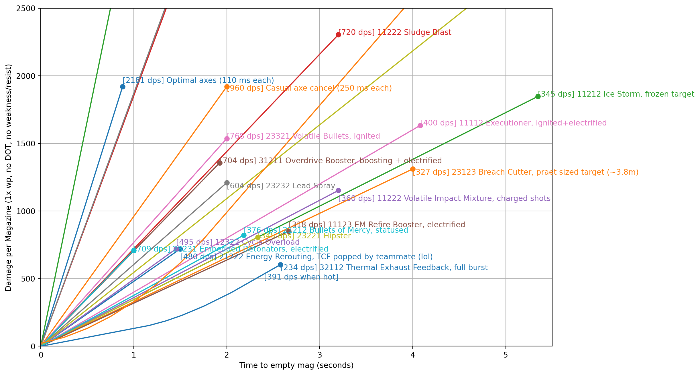
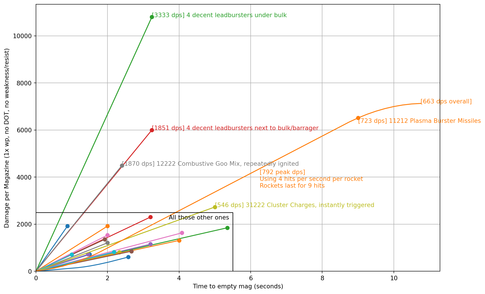

[DRG Analysis](README.md) > **Burst DPS**

# Burst DPS

I got curious and decided to figure out which weapon has the highest finite burst DPS per magazine.

Rules:

- DPS must be finite (cannot take 0 time)
- Burst ends when reloading or out of ammo, or overheated
- No resistances, no weaknesses, and 1x weakpoint counted
- No extra damage over time counted (burning, electrocution, corrosion etc)
- Projectile weapons assumed to hit instantly
- No shots miss except with leadburster
- Leadburster includes time taken to shoot all its bullets
- Reasonably standard build used even if there is a theoretically higher DPS one (for example, Overdrive Booster could take t1 damage but usually doesn't)
- If something isn't on here, it's probably lower DPS

Winners:

- Highest DPS under these rules is **4 leadbursters under a bulk**
- Second highest is **axe cancel**
- The simplest fast dread kill is probably **Sludge Blast** (no temperature/status/wp hit needed). Fastest with some (minimal) setup is probably conductive thermals + ice storm.
- When considering weaknesses and status, the highest DPS is probably using VB to hit a weakpoint of something that has maximum multipliers (conductive thermals, MFD, IFG, critical weakness, etc). Though, most enemies would be oneshot so it maybe isn't finite DPS.

[Back to DRG Analysis](README.md)