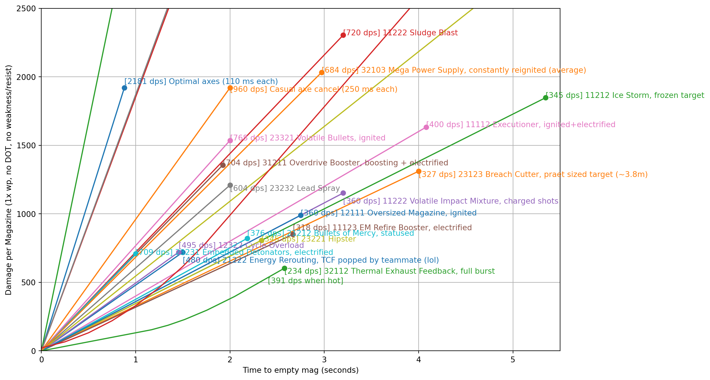
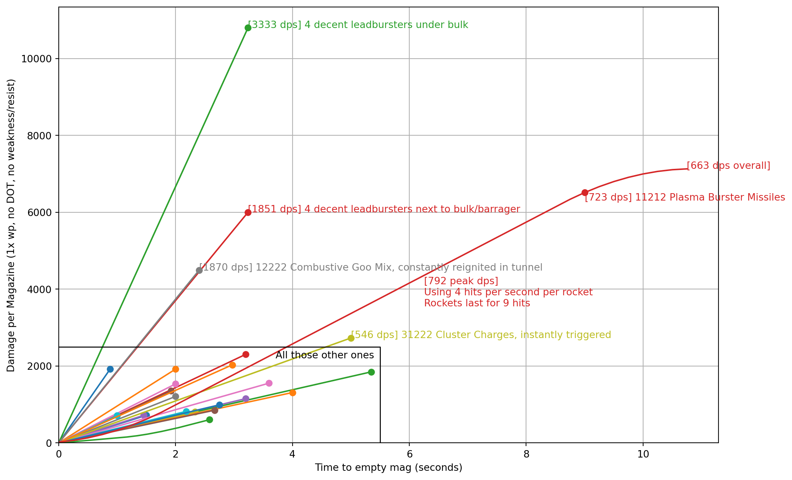

[DRG Analysis](README.md) > **Burst DPS**

# Burst DPS

I got curious and decided to figure out which weapon has the highest finite burst DPS per magazine.

Rules:

- DPS must be finite (cannot take 0 time)
- Burst ends when reloading or out of ammo (Rate of fire delay is included after every shot, including the last shot), or overheated.
- No resistances, no weaknesses, and 1x weakpoint counted
- No extra damage over time counted (burning, electrocution, corrosion etc) except leadburster
- Projectile weapons assumed to hit instantly
- No shots miss except with leadburster
- Leadburster includes time taken to shoot all its bullets and do all its damage
- Reasonably standard build used even if there is a theoretically higher DPS one (for example, Overdrive Booster could take t1 damage/t3 mag but usually doesn't)
- If something isn't on here, it's probably lower DPS

Winners:

- Highest DPS under these rules is **4 leadbursters under a bulk**
- Second highest is **axe cancel**
- When considering weaknesses and status, the highest DPS is probably using VB to hit a weakpoint of something that has maximum multipliers (conductive thermals, MFD, IFG, critical weakness, etc). Though, most enemies would be oneshot so it maybe isn't finite DPS.

## Errata

An older version of these plots overestimated the DPS of the sludge pump because I neglected the 0.25s delay before you could start charging the next shot. This has been corrected and I have also updated the wiki.gg page to make it clearer. Alas, Sludge Blast is not as insane as we all thought.

The leadburster damage values are only rough estimates, as there is significant variation depending on exactly how the throw works out (number of bullets that hit, distance each bullet travels before it hits, etc). Also, the leadburster applies a damage-over-time effect that ticks only once and does 100 damage regardless of how many bullets or leadbursters hit. This effect lasts 0.7 seconds, after which it can be re-applied.

[Back to DRG Analysis](README.md)