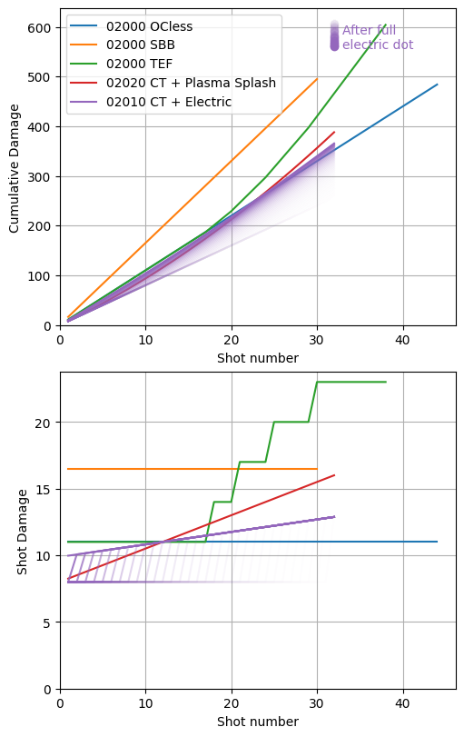
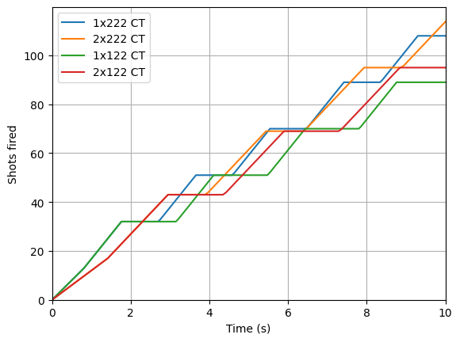

[DRG Analysis](README.md) > **Conductive Thermals**

# Conductive Thermals

## Basics

If you didn't know, Conductive Thermals (CT) is an overclock for Scout's Drak-25 Plasma Carbine that applies two status effects to whatever it hits:

1. **Temperature effect**: x0.95 to the enemy's burn/freeze/douse/thaw temperatures. Also sets the burn and freeze temperatures to +/-100 if they were originally larger, which makes Glyphid Dreadnoughts ignitable. Can be applied additional times by subsequent shots, up to a maximum of 30 times.
2. **Damage effect**: -5% resistance to burn/frost/electric damage. ~~Stacks up to 20 times~~ Has unlimited stacks due to what is probably a bug. (With DRG you can never be 100% sure whether some behavior is intentional or not.)

In exchange, the gun overheats faster and does less damage per shot. These are very significant downsides when you consider that the base Drak already overheats kinda fast and doesn't do much DPS.

## Double stacking

I have to start out with a confession: Conductive Thermals applies twice as fast when taking the tier 4 plasma splash upgrade: once from the direct hit and once from the splash. This is in no small part due to yours truly - during the experimental phase of season 5, I noticed that the temperature buff was applied by plasma splash but not the damage buff. At the time, Conductive Thermals Drak was not a super strong weapon, especially since the damage stack was capped, and I decided it needed all the help it could get. So, I posted a bug report in the official experimental channels where I showed a clip of the drak hitting armor and applying only the temperature buff. GSG "fixed" this, so plasma splash AND the direct hit would each apply BOTH effects, so now each shot with plasma splash applies two stacks of each effect. Which is quite relevant because time-to-kill improves dramatically, and the stacks expire after a limited time so applying twice as fast means you can get twice as many at maximum.

## The stack cap

The stack cap being removed for the damage effect is a very useful change, regardless of whether it was intentional. I hope it doesn't get nerfed too hard - this overclock has a nice single-target niche now with the double stacks per shot going up to uncapped amounts, and is now solidly mid. (A joke I've used a few times is that if every downside was replaced with an equal and opposite upside, that would be another way to make this overclock mid.) Combined, this allows you to get up to the realm of 200 stacks of the damage buff, or +1,000% fire/frost/electric damage vulnerability. This leads to incredible single-target damage when paired with an appropriate damage source - simple fire and taser bolts become absolute DPS beasts, and wait until you see Driller's Ice Storm or Gunner's Volatile Bullets. 

Yes, you will find clips of people using Conductive Thermals to absolutely obliterate bosses, and you might get the impression that it's incredibly overpowered. However, all those bonuses take a while to apply and are lost when you want to switch to a new target, meaning that Scout's ability to kill multiple grunts or pick off a few trijaws gets absolutely terrible. If this overclock deserves a nerf, I think just making it wear off faster on bosses would be sufficient - since the rate of fire is limited, this would reduce the maximum practical stack number you could apply, and it's surely not too difficult to implement since Marked for Death already wears off faster on bosses. Without the super stacking, the original capped CT was just "drak but worse" which is tragic since base drak is already sad, and Conductive Thermals is a cool idea.

## Damage analysis

Here's a graph comparing damage values for various drak builds. The curves for the electric upgrade have varying opacity to reflect how the electricity has a random chance to apply on each shot.

Conductive Thermals really takes a while to build up DPS, and spends a long time ramping up even with the double application from plasma splash. For sniping high-value targets (usually Scout's job) it's way worse than TEF, since TEF is able to sustain high DPS when switching targets whereas CT must build up stacks again each time. This tends to remove Scout's ability to do his normal job and relegates him to a status effect dispenser on large tanky targets. Fortunately, with the two behaviors mentioned above, CT does make the class effective and fun to play in this role as long as the high-value killing and can be filled by someone else.

Despite Plasma Splash doing only 2.5 fire damage per shot, the uncapped double stack application makes it quickly come to dominate the weapon's DPS if you shoot more than one burst. Eventually it will also start being able to compete with TEF, though only on that one target.

Somewhat less spectacularly but still very usefully, the temperature status effect makes it much easier to freeze goo bombers and Naedocyte Breeders.

## Build comparison

This graph shows how many shots you can get out if you try as hard as possible (stay above 50% heat whenever possible to take advantage of the rate of fire buff from t5b).

Large targets are not particularly hard to hit, so you might as well lean into the overclock by taking t1a (rate of fire) or t1b (less heat per shot) instead of the usual t1c (higher projectile velocity). Likewise, in tier 3 you can afford to skip t3a (accuracy) and instead take faster cooling (t3b). 

From the graph, it's clear that t3b (faster cooling) gives better sustained output than t3a (accuracy) assuming you don't miss. This is not surprising.

In tier 1, the choice is less clear. The total output after 10 seconds is slightly higher with t1b, but not by much, and it only decisively pulls ahead if you take t3a and shoot for longer than 7 seconds. You can kill a high-value target slightly faster in ideal circumstances with t1a (rate of fire), but taking t1b (less heat per shot) makes that kill more consistent and more flexible. You're less likely to overheat in combat with t1b, and your shots are spread over a higher duty cycle so it's a bit easier to time those bursts to just barely avoid overheating. I think it's down to your personal preference.

[Back to DRG Analysis](README.md)