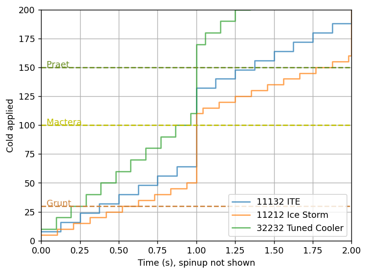
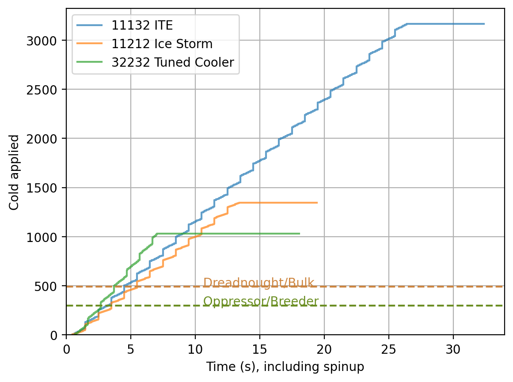

[DRG Analysis](README.md) > **Cryo Cannon**

# Cryo Cannon

The following things are often said about the cryo cannon:
* 11132 is the best build without overclocks
* Tuned Cooler is a bad overclock
* Cold Radiance is way better than Fragile

Here's an analysis showing why those opinions are popular.

## Basic Mechanics

When you hold the fire button on the cryo cannon, there's a brief spinup period and then the weapon starts shooting. Similar to the flamethrower, its direct stream hits everything in its area of effect with both damage and cold, and it can pierce any amount of enemies in that area, and it leaves sticky ice on the ground which deals 8 cold every 0.5s. It has a rate of fire, which determines how often the stream applies its effects on enemies. The sticky ice does not depend on the rate of fire; it instead varies with your game's FPS.

Instead of a conventional magazine, the Cryo Cannon's firing time is limited by a quantity called pressure, which gradually depletes while you shoot and gradually replenishes when you stop shooting.

## Cold Radiance

Cold Radiance works very similarly to Heat Radiance on the flamethrower. It activates after 1 second of shooting (doesn't start counting until the spinup is done), and then once at the end of every second after that. It applies 60 cold in a 4 meter radius around you every activation. Unlike the flamethrower's radiance, Cold Radiance applies only cold and not damage. However, this is just fine since cold is a much more instantly debilitating effect than heat.

Cold Radiance is a very powerful safety tool, as it applies enough cold to instantly freeze grunts on activation, so it's very difficult for them to reach and attack you even when you're surrounded. Additionally, Cold Radiance applies cold at a rate comparable to the cryo cannon's main stream, so it's helpful to use aggressively against enemies that are harder to freeze, like Praetorians or Oppressors. This results in the cryo cannon being a quite effective close-range brawling tool where you wade directly into the swarm and freeze everything. As one of my friends once said, "Cold Radiance isn't an upgrade for the cryo cannon. Cryo cannon is a vehicle for Cold Radiance."

On the other hand, the fact that so much of the weapon's power is tied to Cold Radiance means that you need to pay attention to how upgrades on the weapon interact with it. In particular, Cold Radiance's massive benefits require you to keep shooting and shooting, so its "hold m1 + w" playstyle means you spend a LOT of time shooting. This, in turn, rewards magazine size (actually pressure) and ammo upgrades more than rate of fire or stream cold upgrades. Also, if you run out of ammo or mag, you very quickly run out of safety.

## Analysis

### Freezing power

First we have a graph comparing stream+radiance cold applied by three quite different Cryo Cannon builds:
* 11132 Improved Thermal Efficiency (ITE), a clean build that is essentially the basic cryo cannon built to take advantage of Cold Radiance. This is the standard build for Snowball and Ice Spear as well.
* 32232 Tuned Cooler, which is built for a high freezing rate. People seem to use different builds for Tuned Cooler but I think this is one of the stronger ones.
* 11212 Ice Storm, a special overclock which has weak freezing power in exchange for doing massive damage especially to frozen enemies.

The graph shows the steps caused by the cryo cannon's rate of fire so we can tell exactly when an enemy might be frozen. Cold Radiance shows up as a massive jump of 60 cold at exactly 1 second. The Tuned Cooler build has both faster flow rate (meaning the direct stream procs cold more often, while Cold Radiance doesn't) and an additional freezing power upgrade, taking the freezing power from 9 to 10. This might make a small difference since enemy freezing temperatures are multiples of 10, but at most this tends to make a difference of 1 cold particle which is 1/8th of a second. Additionally, you will be leaving sticky ice on the ground, which adds a non-multiple-of-10 amount of cold, and can get you to a freezing breakpoint without bothering with the freezing power upgrade at all. This is not shown in the graph.

What the graph does show is that grunts freeze extremely quickly with all three builds when you point the direct stream at them, and noticeably faster with Tuned Cooler. However, grunts all get instantly frozen by Cold Radiance even when you aren't pointing the stream at them, so their exact freezing speed is basically a non-issue. The only time you would care is if you're trying to freeze grunts at range, but grunts at range are not an urgently threatening target.

Mactera Spawn and Tri-Jaws are more threatening targets. Pointing the direct stream of our Tuned Cooler build at a mactera will freeze it 0.135 seconds faster than Cold Radiance - starting from zero, and not counting any difference in spinup time between the builds. (Tuned Cooler has +0.2s spinup time built into the overclock.) If you were already shooting, then you'll get a Cold Radiance activation earlier, which may wipe out that advantage completely. In most cases, I think it's a wash. So the real benefit of Tuned Cooler seems to be that it freezes very large enemies faster (which tend to be the least urgently threatening enemies due to their slowness) and freezes bugs faster when they're outside of Cold Radiance range. In exchange, Tuned Cooler has a long spinup, significantly less ammo efficiency, and takes longer to recharge. In fact, the build shown takes 6.4s to empty its mag and 10s to recharge, meaning it has less than 40% uptime. Whether this tradeoff is worthwhile is up to you, but it seems the popular opinion is that it's not worth it. I tend to agree. 

I also want to add that upgrading the freezing power has diminishing returns because pretty much every enemy of concern freezes quickly enough already. Once it's frozen, the threat is removed so that's basically like a kill. So upgrading freezing power any further is like upgrading a DPS weapon from 900 DPS to 1000 - it already kills everything fast enough for the difference to be academic. You might as well take ammo and mag upgrades instead.

I included Ice Storm because it's a special case where the overclock decreases freezing power, making the weapon even more dependent on Cold Radiance (because Cold Radiance doesn't get decreased). The Ice Storm build also takes a rate of fire increase which adds even more DPS, but makes it even more punishing ammo-wise.

### Uptime

Just for fun, next is a comparison of how long your "magazine" lasts for each build. The horizontal segment at the end of each line is the time it takes the pressure (magazine) to fully recharge, though note that you can start shooting again before the recharge is complete. This recharge time includes the repressurization delay, which is 1 second for every overclock except Snowball and Ice Spear.

I added breakpoints for bigger enemies, but in practice:
* uptime matters less because you want to freeze large bugs, and more because you want to maintain that bubble of Cold Radiance safety during a swarm
* uptime is never a problem for ITE. (Lol)

Also this graph does include spinup time, so if you look closely you'll see that the first Cold Radiance activation is later for Tuned Cooler. Note again that the Tuned Cooler build recharges slowly, reducing its ability to provide constant safety.

### Crystal Nucleation

I have not analyzed Crystal Nucleation since that overclock is much more complex mathematically. Notably, with Crystal Nucleation it is actually good to take at least one freezing power upgrade because the first one *doubles* the cold application rate of the overclock's signature ice trails, while the second one brings that up to triple. Taking even one actually does make a notable difference in effectiveness. It allows you to use the trails as your main cold source, reserving Cold Radiance for when you need a power boost or for panic mode, or for pushing aggressively forward. It also allows you to switch away from a "hold m1" playstyle and use the weapon in shorter bursts, which I like.

## Personal remarks

Has Cold Radiance always been 60 cold? I thought it was 80 for the longest time. Oh well.

[Back to DRG Analysis](README.md)