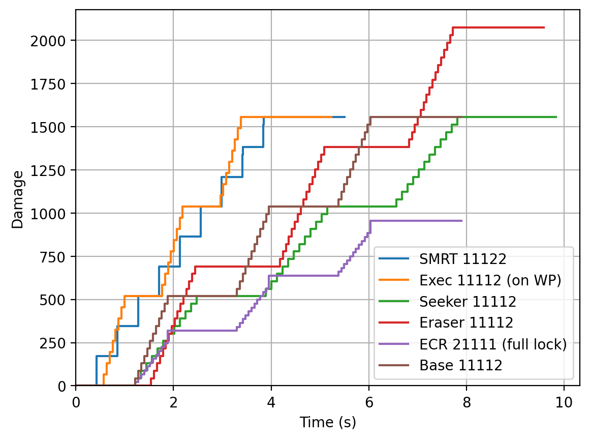
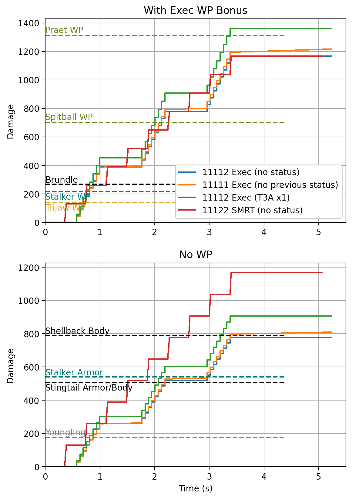
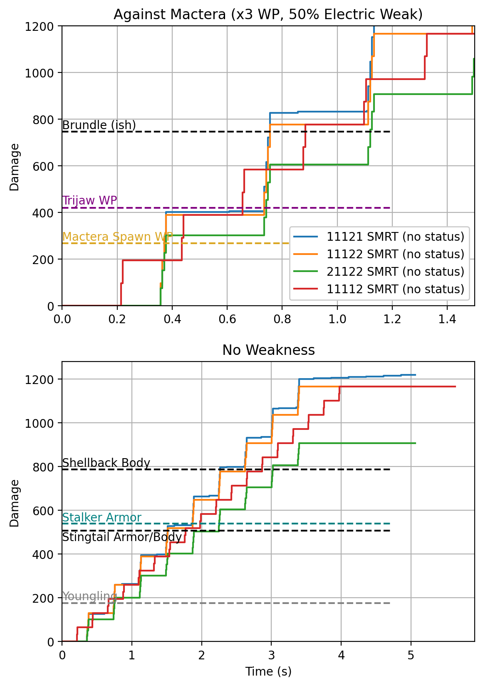

[DRG Analysis](README.md) > **LOK-1 Smart Rifle**

# LOK-1 Smart Rifle

## About the gun

The LOK-1 Smart Rifle is a powerful primary (if you take the right builds) that gives up the reactiveness of stubby in exchange for range, armor break, and higher potential DPS if you(r team can help) activate the powerful T3A upgrade. 

SMRT Trigger OS is an overclock introduced in Season 5 that allows you to gain back most of that reactiveness, but in exchange you give up the opportunity to run Executioner whose massive weakpoint bonus helped make up for the weapon's tight base ammo pool. Still, a lot of the general public has been sleeping on SMRT Trigger OS. It kills single targets extremely quickly, at a rate competitive with or exceeding Executioner, which was the previous reigning champion among single-target LOK-1 builds.

The upgrade tree of the weapon is in a rather sad state. Most tiers have preferred or strongly preferred options with a few specific edge cases.
* In Tier 1: 
  * Damage vs ammo, neither option leaves you with much total ammo so you might as well take damage and get better DPS. Ammo does give slightly more total damage but it's still not ideal. I suppose you can take it if you want. I will analyze the builds assuming you take damage, except for the standard ECR build which is not focused on single targets and takes ammo.
* In Tier 2: 
  * T2A (tight lock-on field, long range) is generally considered the best in that tier as it allows you to precisely specify which target you want to place locks on - obviously a useful capability for a single-target weapon. It also gives you a huge range. It is even useful for ECR to concentrate three locks onto a single target in order to activate the overclock's signature explosion - with a wider lock-on field, the locks tend to get scattered over multiple targets which can waste both time and ammo.
* In Tier 3:
  * T3A (electric/fire synergy) is up to a 40% damage upgrade if you can apply statuses (and is additive with T5B for up to 60% total bonus). The extra damage is dealt as Electric or Fire, which means it is even more effective against many enemies such as Mactera. However, it does not count toward breaking armor.
  * T3B (SMRT targeting) is sadly a throw pick for single target applications, making it often impossible to get T5B (damage bonus at full lock) and also not accounting for a million factors such as armor which may mean it actively *prevents you from killing enemies*. It also makes it impossible to activate ECR on swarmers if you're going for AOE. 
  * T3C (blowthrough) is not a great pick for single target applications because blowthrough doesn't work until after the bullet hits your locked target, and it's not a great pick for AOE because it's glitchy and causes ECR to straight up fail to activate.
* In Tier 4:
  * T4A (faster locks) is very good, increasing your effective rate of fire. 
  * T4B (more locks) is only marginally useful while making it harder to activate T5B (damage bonus at full lock). Exception for SMRT Trigger OS since it makes your lock-ons instant anyway, therefore just being a rough x2 rate of fire multiplier.
* In Tier 5:
  * T5A (electric DOT) is very good and can activate T3A (electric/fire synergy) on shots after the first. Also, the electric status immediately ticks at the instant it's applied, which helps make up for the missing T3A bonus on the first shot.
  * T5B (damage bonus at full lock) is also very good, and the choice between it and T5A mostly comes down to whether you expect to have a plentiful other source of electricity. Or even if you're only expecting to have bulks in IFG, it could be worth taking just for extra performance in that specific case. Up to you. T5B, like T3A, does not count toward breaking armor.
  * T5C (fear) barely applies enough fear to do anything and is competing with significant damage/utility upgrades. Oof

## My complaints

There are quite a lot of fiddly details that become annoying when trying to calculate the DPS of this gun.
* There is a complicated sequence of events that happens each time you fire a burst:
  * You start holding the fire button
  * There's a delay of ~0.22s before locks begin to be acquired
  * Locks are gradually placed on the target (lock time appears to be ROUNDED UP to the next whole number of frames, so this is FPS dependent. Locking on with Executioner at 30fps is 50% slower than at 90fps)
  * The gun waits for you to manually let go of the trigger, which you are almost certain to do a bit late (thus losing DPS) or a bit early (thus getting less than full locks and losing T5B/Executioner)
  * The gun fires the locked shots in a burst (time between bursts is also ROUNDED UP to the next whole number of frames)
  * There is a 0.2s delay before the start of the next cycle (or the start of the reload) due to the gun's actual rate of fire of 5 (which is the rof at which you can tapfire)
  * Finally, SMRT Trigger throws much of this out the window, letting you hold down the button and locking on much faster and ditching the 0.2s rate of fire delay and having an extremely high burst rate of fire. There are additional anomalies with it that make it hard to figure out how to predict. Therefore, SMRT Trigger is best analyzed by just recording the game and timing the recordings. There's also the framerate variation to worry about.
* The following things do not change simultaneously and tend to be offset by a few frames from each other. The best approach is to pick one of these and use that one only:
  * The lock icon on the target
  * The lock bar on the left of the crosshair
  * The magazine counter on the weapon model
  * The magazine counter on the HUD
  * The health bar of the target
  * The visual firing animation of the weapon (which we could further dissect into multiple components but I'll spare you the details)
* T3A can get bonuses or not depending on what status effects the target has.
* T5A electric upgrade adds an additional electric DOT which can affect T3A.
* Normal fiddly DRG details like punching through armor and hitting weakpoints and random invulnerable pieces of enemy models and reload cancelling and etc etc etc.

### FPS dependence

Measuring the actual effective rate of fire of the weapon is quite an annoying task as it involves going through gameplay recordings frame by frame. My machine isn't capable of going much above 90fps even in the sandbox, but I was able to fake 6000fps by using [Better Time Control](https://mod.io/g/drg/m/better-time-control) to run the game at 1% speed. There are a number of combinations that I didn't bother testing.

| Build      | 30 FPS | 60 FPS | 90 FPS | 144 FPS | 6000 FPS | Ideal |
| ---------- | ------ | ------ | ------ | ------- | -------- | ----- |
| 11112 Exec | 5.27   | 6.00   | 6.15   | -       | 6.85     | 6.88  |
| 11122 SMRT | -      | 9.37   | -      | 10.06?  | 10.30    | 10.65 |

You can see there is quite significant variation depending on FPS. As I said above, I'm pretty sure lock-on intervals and burst shot intervals are getting rounded up to the next whole number of frames, but I really can't be bothered to go through any more frame-by-frame recordings so this will have to remain not-completely-proven. It does work out fairly closely (+/- 1 or 2 frames) for the recordings I did analyze. 

The 10.06 effective rate of fire at 144 FPS for SMRT Trigger was obtained not by testing, but from the rounding-to-the-next frame theory. It's certainly between the tested results for 60fps and 6000fps, so it should be in the right neighborhood. Most people get better performance than I do on my potato setup, so I think this is a good FPS value on which to base build and gameplay analysis. Just, when I give results that involve timing, take them with a grain of salt.

## General build comparison

OK so how to analyze this weapon? For the graph below, I'll make some simplifying assumptions:
* You are running an extremely high FPS so your lock-on and burst times are minimally affected. I'm assuming infinite/ideal FPS for non-SMRT because that's easier to calculate, and 144FPS for SMRT to avoid too much bias in SMRT's favor (because this article has already turned out to be kind of a SMRT propaganda piece)
* You play perfectly and let go of the trigger immediately when the gun reaches max locks (except SMRT Trigger OS where you just keep holding the trigger). I tried adding a 0.2s delay to the trigger release to simulate human error, but it didn't make a huge difference and with enough skill you could probably get the release to be near frame perfect anyway.
* T3A and T5B are always active to their full extent (though the fire/electric DOT that activate them won't be counted into the damage, only the T3A bonus)
* Reasonable reload cancels are performed according to [LazyMaybe's timings](https://www.youtube.com/watch?v=TQ0-ysX-ZX4).

This graph assumes you start holding the trigger at time 0. The last horizontal segment in each curve is a reload (with reload cancel). For slow-locking builds, the reload takes about as long as filling up the lock bar. 

SMRT Trigger and Executioner are clearly the most reactive and have the highest DPS. You can see why the two of them are considered so much stronger than the base weapon. ECR is also considered strong, but obviously not as a single-target weapon, being more useful for its explosion which inflicts some AOE and fear. (Ideally you want to use bursts of 3 locks to spam explosions rather than full lock, but the 3-lock version of the graph went way off the right edge so I decided to just not show it. You can still full lock if you want to deal with a single target.) Seeker has the next lowest DPS, with less than half the burst of Executioner (though slightly more than half if you include the reload time.) 

## Different cases of Executioner (ft. SMRT Trigger)

Since SMRT and Exec are our top single-target contenders, let's look at them in a little more detail. This time, I have specifically noted which bonuses apply. T5A electric dot is included. 

I have also added breakpoints (Haz6p4), though not accounting for enemy resistances/vulnerabilities to electricity or fire. Enemies with breakable heavy armor (Brundles, Stingtails) tend not to punch through until the second hit, so I have added one bullet's worth to their effective health.

Note how T5A electricity loses a small bit of damage up front, but ends up slightly ahead over time. When combined with the power of electric slow, I think this makes 11111 usually worth taking over 11112. The exception is if you want to combo with some separate source of electricity, because then 11112 gives a much bigger damage boost (green line).

### Executioner vs SMRT

If I add a 0.2s human-error delay to Exec's mouse release, then SMRT consistently kills faster than Exec even when Exec is hitting weakpoints. (The exception is when 11112 Exec gets T3A and SMRT doesn't, which isn't a fair comparison. I added that Exec case more as a comparison against the other Exec cases.) 

When Exec isn't hitting weakpoints, it falls way behind. There are a few quite notable enemies where this is relevant, especially shellbacks. You can only one-mag a rolling Haz6p4 shellback with Exec if you happen to hit the weakpoint, or if you take 11112 and the shellback is on fire (rolling shellbacks are completely immune to electricity). 

The tradeoff for SMRT's DPS and reactiveness is that as I mentioned at the beginning, SMRT Trigger OS doesn't get many massive bonuses to increase its total damage pool. So you'll have to pick your targets and be mindful of your pacing, especially in teams where resupplies are less plentiful. Still, it's way better than the base weapon and I think it deserves to have a reputation equal to Executioner's.

## SMRT vs SMRT

If you are particularly interested in SMRT Trigger, here is a further build comparison for SMRT specifically.

Featured builds:
* **11121 SMRT**: A good pick. Damage, 4 locks, and electricity. This comes out with the highest DPS in most cases due to electric damage over time, plus has electric slow. Waiting out the full electric DOT grants a bit more than an extra shot's worth of damage. 
* **11122 SMRT**: A good pick. Damage, 4 locks, no electricity. This is the best of all Engi primaries against rolling shellbacks (which are immune to electricity), and highly competitive with 11112 Executioner for other large targets that have some other source of electric status. Though, it's often harder to aim for things like Bulk weakpoints.
* 21122 SMRT: I'm not sure about this one. Included here to show what happens when you take the ammo upgrade instead. Longer time to kill, slightly more ammo efficient, nothing too surprising.
* 11112 SMRT: Not great. Included here to show what happens when you take the 2-lock version of the gun. You can *sometimes* kill small targets more quickly, but the net rate of fire works out to be lower. On moving targets with heavy armor, you are also less likely to keep hitting the same armor plate that you broke with an earlier shot, which decreases damage output. 
  * If you take 11111, you can milk the electric DOT's full value more easily to get a bit more ammo efficiency. However, your time to kill on small enemies will be a lot slower if you want to really use the electric damage, and the attention cost is much higher. I don't recommend this strategy.

## SMRT Breakpoint Samples

Breakpoints for Executioner are already given [on technicaldrg](https://www.reddit.com/r/technicaldrg/comments/wi63o3/lok1_executioner_breakpoints_haz6p4/), so I will put some SMRT breakpoints here.

The table below shows the number of shots taken to kill various bugs in combat tests (with bug AI enabled). Because Brundles and Shellbacks move a lot, their results are given as a range of what I experienced. For Brundles, I tried to consistently hit the same armor plate with each burst. For Shellbacks, I tried different situations of shooting them at long range vs in chaotic close quarters. Note that the curled up legs of a Shellback are completely invulnerable. The trials that took the most shots were due to shots getting blocked by this effect. Imagine shellbacks as a rolling car tire: aim for the tread, don't aim for the hub.

|       | Mac Spawn | Trijaw      | Brundle    | Acid Body       | Acid Head   | Web Body | Grunt Body  | Slasher Body    | Shellback, Rolling (H6p4) |
| ----- | --------- | ----------- | ---------- | --------------- | ----------- | -------- | ----------- | --------------- | ------------------------- |
| 11111 | 3         | 5, or 4+dot | 9-14       | 5, or 4+dot     | 3, or 2+dot | 2        | 4, or 3+dot | 6, or 4+dot+dot | 40-53                     |
| 11112 | 3         | 5           | 11-20      | 5               | 3           | 2        | 4           | 6               | 30-47                     |
| 11121 | 3         | 5, or 4+dot | usually 9  | 5, or 4+dot     | 3           | 2        | 4           | 6, or 5+dot     | 37-50                     |
| 11122 | 3         | 5           | usually 10 | 5               | 3           | 2        | 4           | 6               | 23-40                     |
| 21111 | 4         | 6, or 5+dot | 12-22      | 6, or 4+dot+dot | 3           | 2        | 5, or 4+dot | 7, or 5+dot+dot | 58-65                     |
| 21112 | 4         | 6           | 13-26      | 6               | 3           | 2        | 5           | 8               | 50-61                     |
| 21121 | 4         | 6, or 5+dot | 12-16      | 6, or 5+dot     | 3           | 2        | 5, or 4+dot | 7               | 46-61                     |
| 21122 | 4         | 6           | 13-19      | 6               | 3           | 2        | 5           | 8               | 42-56                     |

Conclusions:
* 11122 is the most reliable build for one-magging a rolling Shellback
* Electricity is notably better against Brundles (and presumably other tanky Mactera enemies)
* Despite outputting slightly less damage in the first burst, Electricity doesn't lose breakpoints on small enemies like grunts or spitters
* Electricity can often let you save one shot on small targets if you're willing to wait for DOT, but as I noted in the previous section I don't think this is really worth it

[Back to DRG Analysis](README.md)