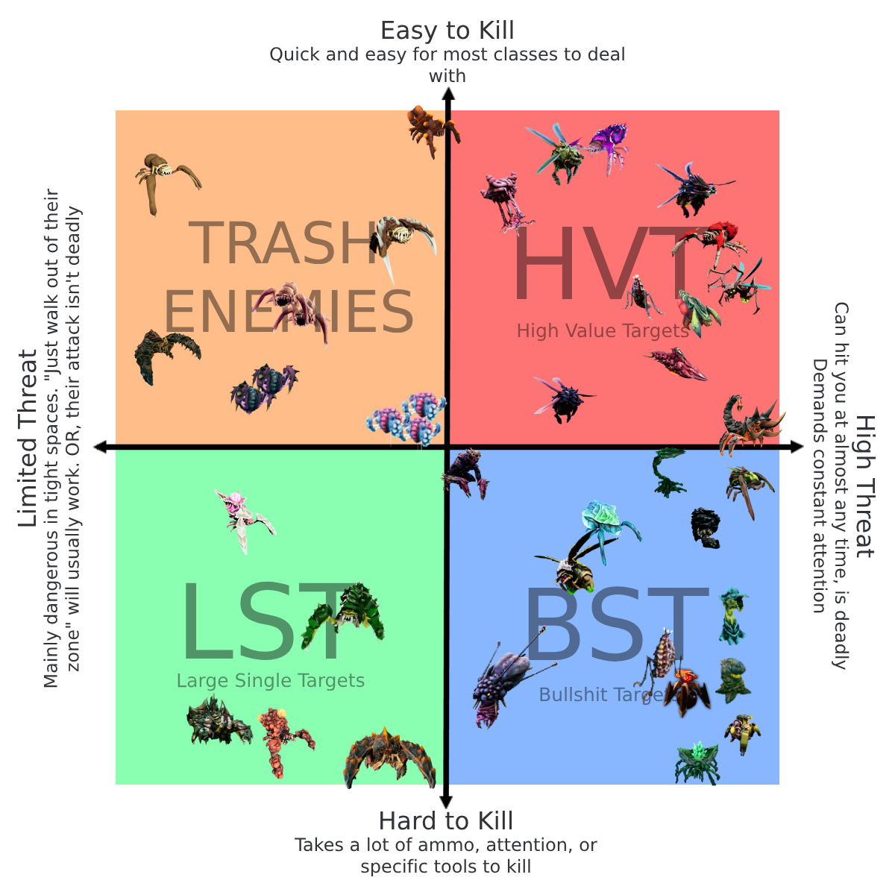
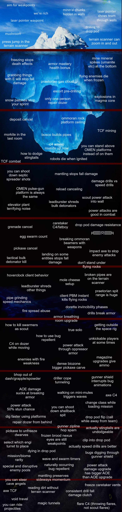
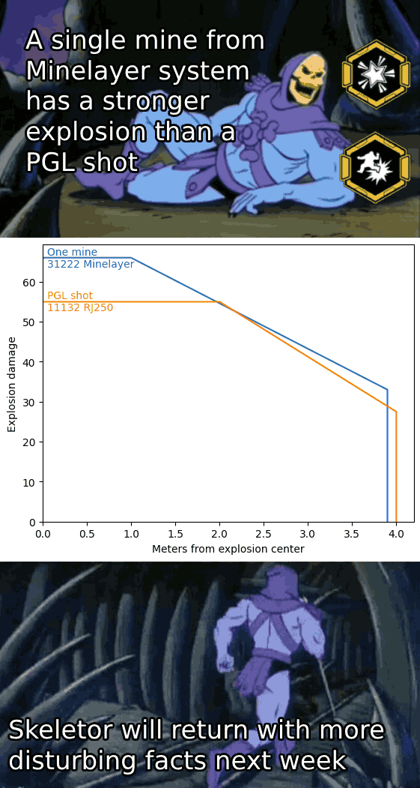
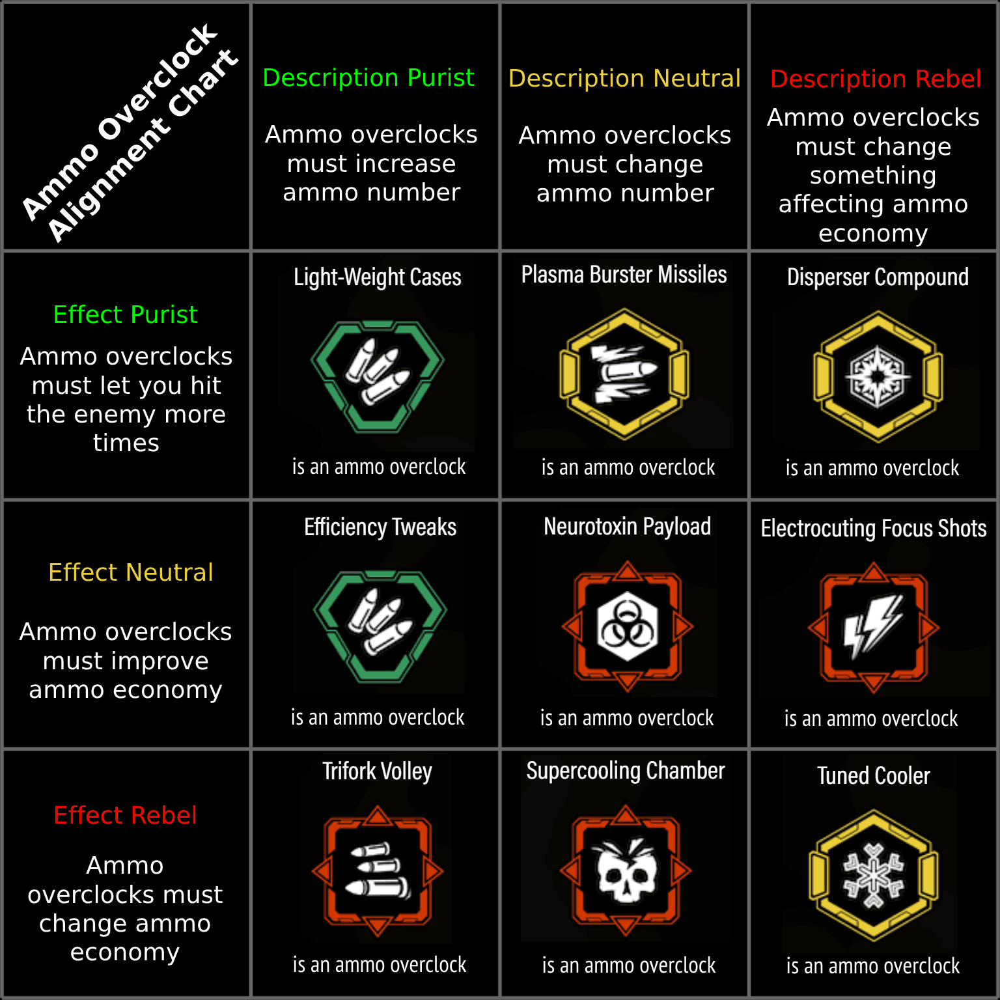
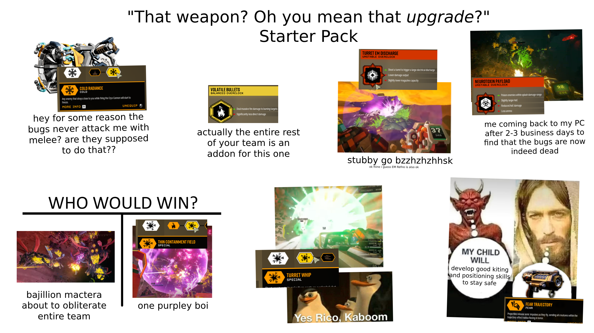
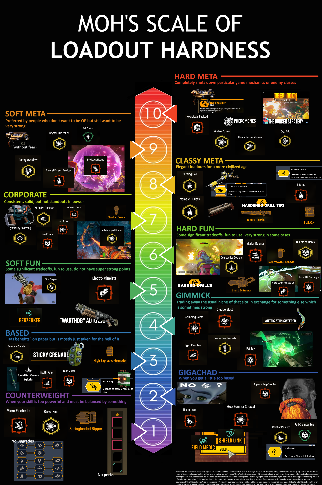

[DRG Analysis](README.md) > **High Effort Memes**

# High Effort Memes

Over time I have made a number of DRG related memes. Some of them are more informative or technical than others. I have selected some to be featured here.

## High Value Target Compass

There are several ways to categorize enemies in DRG. Some common terms in the community include:

* High-value targets
* Large single targets
* Trash
* Stationaries

It is not clear what criteria should be used to distinguish between these groups. Some regard all especially threatening enemies as high-value targets, including enemies that are difficult to kill, such has shellbacks and menaces. Others believe that "high value" should mean the enemy poses a high threat but is easy to kill, thus offering a high rate of return on effort spent to target them. Thus, all tankier enemies would be excluded. But then, what category should these enemies be placed in?

In popular commentary, it is popular to consider eliminating "high-value targets" (often without clarifying the aforementioned confusion) as the Scout's job. Due to the tendency of scout loadouts to have limited AOE and total ammo but relatively long range, there is a motivation to spend that ammo on enemies where it will be most effective. Some are best directly shot with the primary weapon, whereas for other enemies it can be better to use cryo bolts, or to use the boomstick to ignite the enemy for Volatile Bullets. This distinction provides a rough dividing line that can be helpful as a starting point for thinking about enemy classification.

In this meme, I present a method of ranking enemies along two cartesian axes describing (1) how threatening the enemy is and (2) how easy the enemy is to kill. Thus, the popular categories of trash, large single targets, and high-value targets fall easily into place, and high-value targets are restricted to those which are easy to kill. I further propose an additonal category for the high-threat, difficult-to-kill targets, which I call BST or "bullshit targets" and includes most traditional stationaries. The name "compass" originates from the "political compass", another (only semi-serious) classification scheme that similarly uses orthogonal axes to produce four categories.

In the high-value target compass, both axes are rather subjective and contain significant variablity depending on mission context, team compositon, playstyles, custom difficulty adjustments, terrain, and other factors. Therefore, the placements I have shown in this particular meme should not be regarded as precise or binding. 

Some factors which contribute to an enemy's threat level include:
* Attack range of the enemy
* Movement speed of the enemy
* Frequency at which the enemy attacks
* How difficult the enemy's attack is to dodge or otherwise nullify, and how much attention is required to successfully do so
* Amount of damage dealt by the attack
* Any other effects dealt by the attack (such as slowing the player, or moving them out of position)

Some factors which contribute to an enemy's difficulty-to-kill include:
* Health, armor, weakpoints, elemental resistances and weaknesses
* Behavior of the enemy (for example, Menaces and Stalkers often attempt to burrow away before they can be killed; Septic Spreaders maneuver evasively, compared to Trijaws which hover in place with their weakpoint exposed)
* Additional steps required to kill the enemy (such as hunting down vartok nodes, cycling multiple phases of bosses, visually identifying a cloaked Stalker, etc)
* Tendency of the enemy to appear in large numbers (such as shockers or swarmers) which makes single-target weapons much less effective against them than specialized lingering AOE weapons

Earlier, I mentioned that Scout is popularly assigned to high-value targets and can assist with bullshit targets. The role of the other classes is more varied. In classic team compositions, Driller handles the trash enemies while Gunner and Engineer flex across the non-trash categories, including assisting Scout with high-value targets if needed. However, even in this classic composition, the roles are not hard rules. Some difficulties spawn high-value targets in such numbers that Driller's primaries are actually best suited to dealing with them. Driller can also end up TCFing large numbers of large single targets such as praetorians and (I forgot to add them) sentinels. If Driller is downed or occupied elsewhere, Gunner and Engineer often still have some form of higher-cost trash clear such as grenades and breach cutter. Meanwhile, a huge array of nonstandard team compositions exist in which Gunner may instead be the main trash clear, or the task is split across several classes, or not all four classes are even present. It is up to the team in each varied case to plan ahead and make sure there is some way to deal with every enemy, even if the result does not adhere to popular conceptions of standard class roles.

## DRG Mechanics Iceberg

DRG has many mechanics, many of which are not documented anywhere in the game itself and some of which are not even documented on [the official wiki](https://deeprockgalactic.wiki.gg/wiki/Deep_Rock_Galactic_Wiki). Additionally, players have devised strategies and techniques that are passed around through the community and tend to be learned over time, but are essentially learned through random encounter with community members. Thus, some are naturally less commonly known.

This iceberg is not comprehensive and I also am not at all confident about how well-known each item actually is. However, it was fun to think of many entries at varying levels of obscurity and try to place them.

## Minelayer

This meme compares the AOE damage performance of the meta Minelayer build against the (arguably) meta PGL build. The fact that Minelayer is stronger is both a condemnation of Minelayer for being overpowered and a condemnation of PGL for being underpowered. 

There is some missing information: This PGL build inflicts an amount of heat equal to the maximum damage and inflicts it across the entire radius, allowing it to consistently kill low-health enemies in a decent area given enough time for them to burn. It also does an extra 60 direct damage to an enemy if the grenade directly hits the enemy, and applies a guaranteed stun in the entire blast radius. So actually it's not as bad as it looks...

Until you consider that Minelayer has over 5x the rate of fire and can cover its own reloads and has about 15x as much ammo. In fact a single magazine of Minelayer contains more than twice as many rounds as the entire ammo pool of the PGL build.

## Ammo Overclock Alignment Chart

In the end, everything is an ammo overclock. (Except Armor Break Module, nobody likes that one)

This started with a few interesting observations:

* Despite being mostly a damage upgrade, Electrocuting Focus Shots is most noted for its ability to allow ammo or magazine upgrades to be taken without sacrificing oneshot breakpoints. Thus, I mentally think of it as a sort of ammo overclock.
* Some overclocks increase ammo economy despite not touching, or in some cases even *decreasing*, the ammo count of the weapon.

In each slot there was often more than one overclock fitting that description. For example, RJ250 could replace the top left, Rewiring Mod and Blistering Necrosis could replace the top right, ECR/Executioner/Gamma Contamination could replace the center, and I'm sure there are many others that could fit in various places. I chose overclocks such that each class and each overclock color would be represented at least twice.

## Weapon-for-the-upgrade Starter Pack

DRG contains a number of upgrades or overclocks that define the power of the entire weapon. The upgrade isn't an add-on for the weapon. The entire weapon is an add-on for the upgrade.

This meme was made for an earlier version of DRG, before damage stubby was buffed into a meta option and before the abysmally bad Turret Arc was reworked into Micro Conductor Add-On.

## Moh's Scale of Loadout Hardness

Provides a (rough, subjective) ranking of loadouts based on their power. Some players tend to avoid the most powerful options for various reasons (they invalidate some game mechanics, they feel boring to use personally, etc). Most players have a natural instinct to optimize their loadout to be good to some degree.

Some explanations in response to objections I have seen:
* Some people do not understand why their favorite weapons, such as AI Stability Engine, Warthog, or RJ250 are not classed higher. These weapons, while solid, tend to lack the strengths of other weapons that compete for the same slot. For example, RJ250 has its upsides, but lacks the killing, defense, and pushing power that Breach Cutter has against non-trash enemies. Warthog has Turret Whip, which is okay in power but is heavily restricted by turret behavior and setup time, and lacks both the low-friction, flexible crowd clear of a dedicated AOE primary or the ranged burst DPS of a dedicated single-target primary.
* People may read an implied statement here that meta builds are not fun builds to play, due to them being different categories and due to the descriptions of meta builds not mentioning that they are fun. I do think meta builds can be as fun or more fun than those I have put in the "fun" categories, but whether being *too powerful* is less fun, and how powerful is too powerful, are up to your preferences. There is not a simple fixed relationship between the amount of fun and the amount of power. To me, the main criterion that lands a build in the "fun" categories (5 and 6) is that they have significant tradeoffs or weaknesses that meta builds do not, and therefore rely more on their fun value than meta builds do - not that they necessarily have a higher total fun level.
* Yes, bunkering is not any particular upgrade or overclock that exists inside a loadout. However, it is often something that particular loadouts are built around.
* I didn't mention ___! Yes, of course I don't have enough room or sufficiently strong opinions to place absolutely every loadout. Also, some loadouts exist across a broad range of the hardness scale. For example, Dash is widely considered the best of all perks, which might warrant a hard meta rank, but it is taken at very high rates on basically any loadout of level 4 and above.

## Copypastas

These are not very informative in any technical matters, but I wanted to feature them anyway because they were sufficiently entertaining to write once I came up with the idea.

(At the bottom of the Moh's Scale of Loadout Hardness, there is the Full Chamber Seal copypasta which I did not invent.)

### Combat Mobility

All the people here who forged this Combat Mobility Overclock to briefly taste its incredible movement speed have precisely the wrong mindset. I, in my exalted wisdom and unbridled ambition, forged this overclock to become fully accustomed to the intensity of its velocity, to make its speed bearable and in fact normal to me, so that all the world around me may fade into a distant arena of transportational inconsequence. And it has worked, to profound success. I have carried the loadout with me, have grown attached to the agility of its swift form, its desire to be one with the wind. This force has become so normal to me that equipping any other loadout now feels like a chain on my ankles, or a squelchy patch of fungus goo. Light bouncy grapply scouts who raise grappling hooks now seem to me as slow elders who use mere stair lifts.

I can hardly remember the days before I became a dwarf of Combat Mobility. How distant those days seem now, how burdened by the sluggishness of everyday loadouts. I laugh at the philistines who still operate in a world devoid of mobility, their feet heavy and unempowered by the experience of dancing with mobility. Ha, what fools, blissful in their ignorance, anesthetized by their lack of meaningful motion, devoid of travel.

Nietzsche once said that a dwarf who has a why can bear almost any how. But a dwarf who has Combat Mobility can bear any enemy less swift, and all this talk of why and how becomes unnecessary.

Schopenhauer once said that every dwarf takes the limits of his own field of vision for the limits of the world. Combat Mobility expands the limits of a dwarf's field of vision by showing him an example of increased motion, in comparison to which the everyday creatures to which he was formerly accustomed gain a slow and sluggish quality. Who can find a swarm daunting, when surrounded by such unresponsive enemies? Who can be defeated by a world of snails and sloths?

Have you not yet understood? This is no ordinary overclock. In this overclock is the alchemical potential to transform your world, by transforming your mobility. Those who have not yet held the loadout in their hands and mouths will not understand, for they still live in a world of normal speed, like Plato's cave dwellers. Those who have opened their mind to the swiftness of Combat Mobility will shift their expectations of motion and velocity accordingly.

To give this overclock a rating of anything less than five stars would be to condemn life itself. Who am I, as a mere mortal, to judge the most agile of all forgeable overclocks? No. I say gratefully to whichever grand being may have created this equipment: good job on the Combat Mobility. It sure does move.

I sit here with my Combat Mobility, transcendent above death itself. For insofar as this overclock will bear me forward, I am in the presence of immortality.

### The Salt Pits Gambit

Hello guys, welcome back to another chess tutorial. Yes, it is me, Glypham Q'Ronul Hoxxek Nayakav Mactesh IV. Today I will show you a simple yet effective trap that dwarves of any experience level will be guaranteed to fall for. It is a variation of the Salt Pits gambit, and I will show you why it is so effective. We will start with a standard opening: First Dirt to Downward Tunnel. Miner Team responds with Advance Forward, progressing to a location that is less than 2m above the surrounding terrain. This is their first mistake, and the game is already over for them. The natural move would be to reveal nitra. However, in the Salt Pits gambit, we will keep the nitra hidden. Instead, we spawn 500 Q'ronar Younglings. However, if you are a beginner at chess, you can use 50 Younglings instead. Now watch very carefully as we completely fucking obliterate the entire dwarf team.

As you can see, our attack was a success. They are unable to recover or revive at all, as the ball pit continually deals damage and bounces them around to prevent recovery. Thank you for watching, and I will see you in the next chess tutorial.

### Herald of Swarms

I am Mission Control, Herald of Swarms. The time of the Launch, the Mission, is near at hand. We must prepare. You will have been paid little, despite the successes of the missions past. Lloyd will appreciate you leaving tips, if you have forgotten this. We will brew mugs of beer directly for you. I wish we could train you formally, but inebriation is so much easier than proper training, and we must have minerals extracted quickly. A sober mind will not serve against what is to come. Driller can train your instincts, and Gunner. . . he will teach you heavy weapons. So much is gained from these missions . . . I will contact R&D. We should have time. Engineer keeps talking about a way to upgrade weapons using Matrix Cores. And you have discovered something unexpected. We will use that. Core Stones that generate Rifts . . . Crawlers. . . Your coming days will be difficult, but with your hard work, Management will prosper. You must board the Drop Pod. The other dwarves should join you soon.

### DRG Curses

(Some explanation here: I tried to come up with curses that cannot be straightforwardly solved by just getting good. So no "may you get 3 bulk spawns on your salvage bubble")

* May your aquarq fall into a steam vent
* May your fuel cells land in fungus goo
* May you get rockpoxed just before aggressive venting
* May your drilldozer run over a core stone
* May your nitra all spawn in the very last room
* May physics throw you across the room while mining minerals
* May you fall into a pit of shellbacks
* May you get leeched horizontally around a corner
* May Molly push you into exploders
* May you drill out of the wall into a magma maggot
* May you keep forgetting to fix your loadout
* May your vartok node be in a whole other room
* May you get yoinked through a wall by Elite Grabber
* May you get silent stalkers from behind
* May you face stingtails hiding on the ceiling inside an oppressor
* May there be no oil shale within sight of your drilldozer
* May you encounter Prospectors that got aggroed 14 times by environmental hazards
* May Harold run away from you up a vertical hole
* May you lose connection at the very end of your deep dive
* May your point extraction minehead land in the most annoying possible spot
* May your korlok healing pods spawn inside the unbreakable refinery rig
* May your favorite weapon get nerfed into the ground next update
* May a magma core earthquake swallow your resupply
* May there be wind vents around your ommoran heartstone
* May your Huuli Hoarder get triggered on the ceiling before you're ready
* May Molly walk away while you're trying to deposit
* May your grapple hook bug out and fail at the most annoying time
* May your grapple hook bug out and fling you at mach speed to your death
* May your drilldozer drill into a crassus
* May you get "Multiplayer session ended" after you already left
* May "Lost Connection" and "Failed to Join Server: UNKNHJSC" visit you often
* May you glitch out of the world and die of fall damage
* May a magma core earthquake slow and prevent you from clutching

[Back to DRG Analysis](README.md)