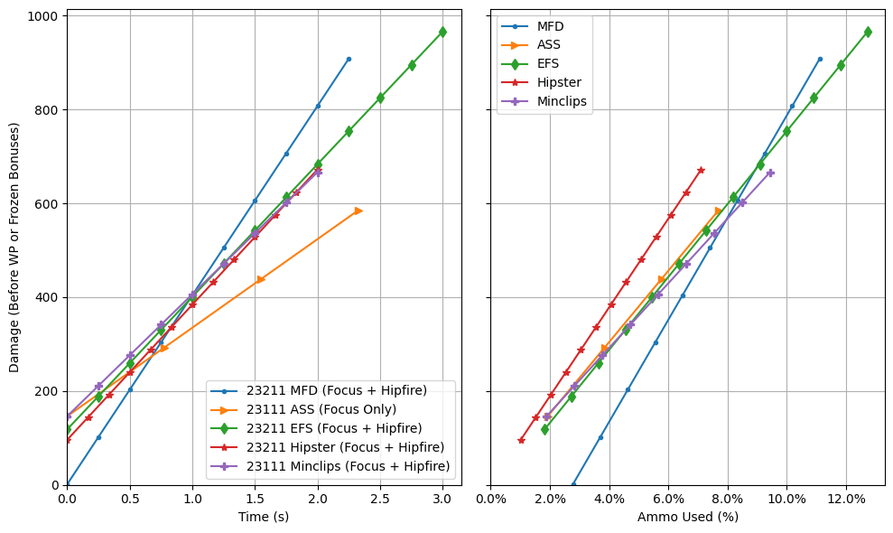
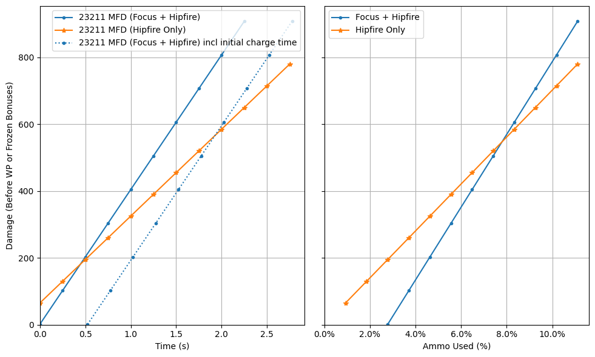

[DRG Analysis](README.md) > **Marked for Death**

# Marked for Death

## Introduction

This is a new overclock introduced in Season 5 for the M1000 Classic. It makes the focus shot apply a x1.55 damage buff to the targeted enemy for 8 seconds (or 4 seconds on dreads) in exchange for removing focus shot damage, increasing focus shot ammo cost, and reducing clip size. (Yes technically it multiplies focus shot damage by x0.01 and not x0, insert nerd emoji)

Removal of all focus shot damage is a steep cost. However, when dealing with large enemies like stationaries or tanks, this overclock certainly has its strengths. I think of this as similar to Conductive Thermals but less extreme - making the weapon much worse against [HVTs](memes.md) but in exchange much better against tankier threats. MFD has a lower power ceiling than Conductive Thermals (smaller achievable damage multiplier) but also makes less of a sacrifice. You can still directly kill things with hipfire, which is more than can be said for Conductive Thermals.

## Build

Briefly:

* In tier 1, we have damage vs ammo. I haven't checked if damage nets any interesting breakpoints, but more DPS is more DPS.
* In tier 2, armor break is always standard for the M1000.
* In tier 3, focus damage is negligible so we are free to take the clip size upgrade. This nets a clip of 12 ammo, compared to the 8 of focus builds and the 14 of Hipster or EFS. Not too bad, even with the overclock's penalty.
* In tier 4, the choice is up to you. For normal M1000 builds we might care about the weakpoint upgrade reaching breakpoints, but we don't have focus shots here so it's not so much about the breakpoints as just general DPS. Note that while blowthrough can damage multiple enemies at once, you can only mark one enemy at a time (that being the most recently hit enemy). However, I think there's something to be said for the ability to hit a priority target despite it hiding behind another target. A relevant thought is to imagine taking weakpoint only for a single jelly to block your MFD focus shot and the jelly doesn't even die. (Lol)
* In tier 5, stun is still stun, fear is worthless due to the lack of focus shot damage, and Killing Machine is fine but I personally still prefer stun.

## Vs other M1000 builds

MFD starts winning the time-to-kill comparison at about 400 damage, which is the exact effective health of a frozen spitballer in Haz5p4, and slightly more than a frozen praet. However, it does not equal other M1000 builds in ammo efficiency until dealing around 600-700 damage.

Keep in mind that MFD can buff the damage of other players or weapons aside from just the M1000's follow-up hipfires, so the focus shot is a bit more advantageous than the graphs alone suggest.

## When to use focus shots

Because of the more costly focus shot, there is an interesting decision-making minigame about whether to use a focus shot or just spam hipfires.

The time-to-kill breakeven point depends heavily on whether your focus shot is already charged or not. The ammo efficiency breakeven point is between 500 and 600 health. For classic squishy HVTs that you would oneshot with a standard M1000, it's probably not worth using the MFD focus shot.

Enemies where focus shots are better in all ways than hipfire include extremely tanky enemies like stationaries, as well as mid-tanky enemies where you don't want to bother freezing or aiming for weakpoints. Some specific examples:
* Boss of any kind, EXCEPT the Caretaker (which is immune to status effects)
* Bulk
* Grabber (I have no clue how people hit weakpoints on these things)
* Menace
* Patrol bot
* Praet/Oppressor
* Rival burst and repulsion turrets
* Rockpox enemies of any kind
* Shellback
* Stalker (? hipfire may be better but 400-500 health makes hipfire vs focus pretty close)
* Stingtail
* Tanky stationaries of any kind - breeder, nexus, spitballer, barrager

| Enemy            | Health (5p4) | Health hitting WP |
| ---------------- | ------------ | ----------------- |
| Burst Turret     | 1125         | 450               |
| Goo Bomber       | 1200         | 400-940*          |
| Grabber          | 750          | 250               |
| Menace           | 1050         | 525               |
| Patrol Bot       | 1350         | 450               |
| Praet            | 1125         | 1125              |
| Oppressor        | 1350         | 1350              |
| Repulsion Turret | 900          | 360               |
| Sentinel         | 675          | 450               |
| Shellback        | 675          | 337.5             |
| Stalker          | 432 or 540** | 216               |
| Stingtail        | 900          | 450               |
| Warden           | 1200         | 400               |

*Goo bomber weakpoints are x3 but break after taking 50 base damage, meaning one MFD hipfire each. 940 is the damage you would need to spend to break each weakpoint + finish off the body, all with un-buffed hipfires.

**Stalkers have 432 base health but also have unbreakable armor covering much of their body that blocks 20% of damage.

[Back to DRG Analysis](README.md)