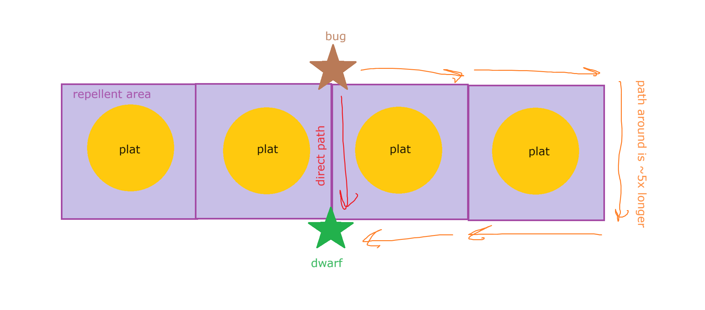
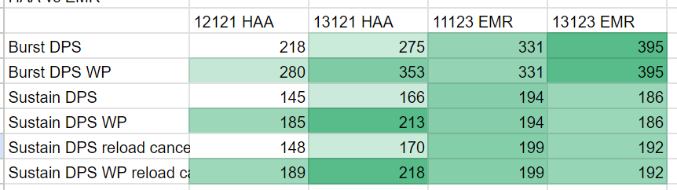
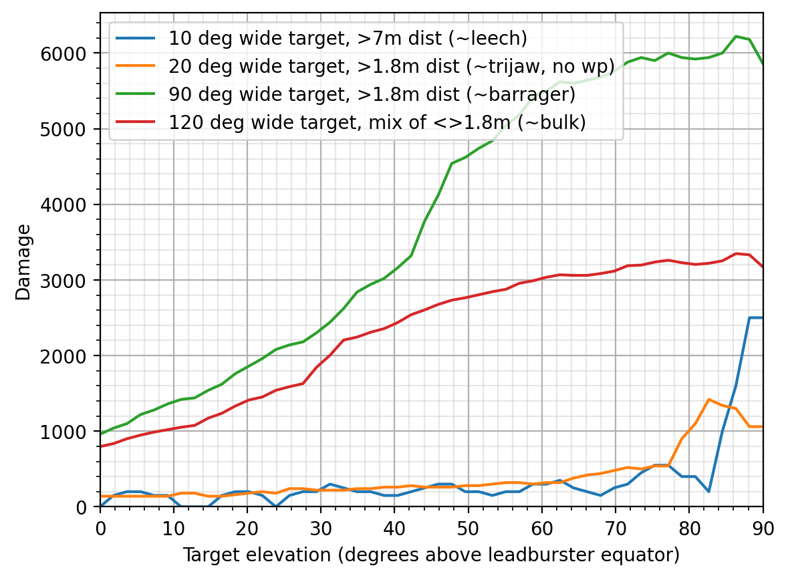
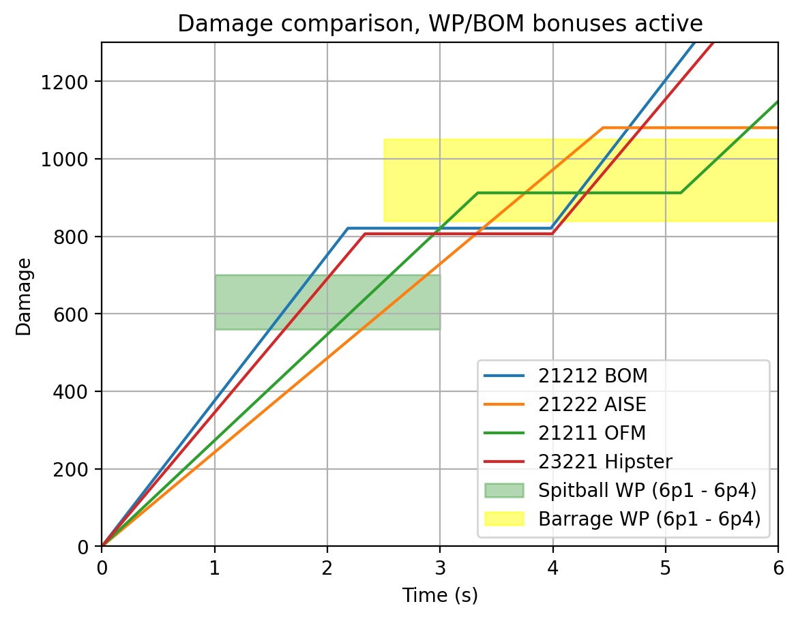
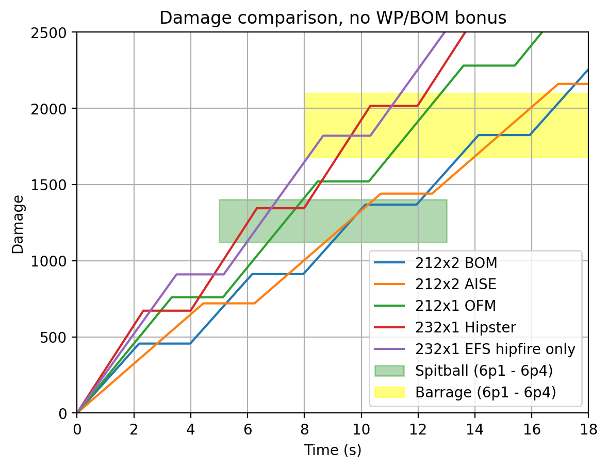
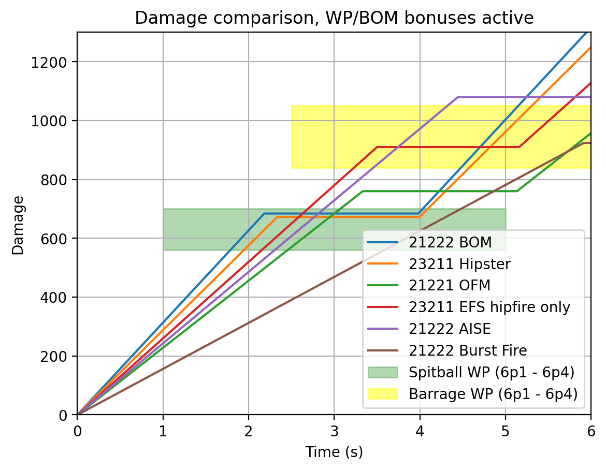
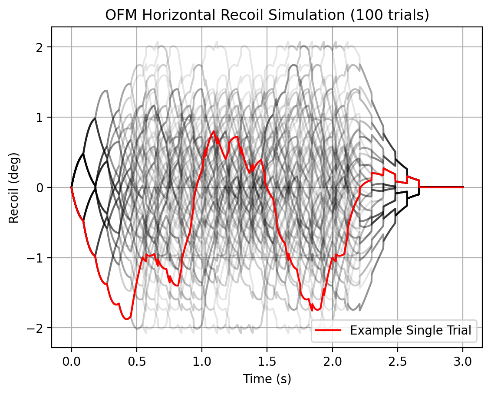

[DRG Analysis](README.md) > **Miscellaneous Graphics**

# Miscellaneous Graphics

Here is where I put various DRG related content that doesn't have a full page or writeup.

## Bug Repellant Strength

There is a commonly known rule that 4 repellant platforms in a row is the maximum before bugs start crossing through them.

There is a common and unsubstantiated idea that repellent doubles the pathing cost in its area. Here I present a simple diagram to illustrate why i think that if it is a cost multiplier, it is definitely not 2x and is probably closer to 5x.

## Damage Stubby

## Leadburster

Based on a combination of spherical coordinates simulation and some jankery in the sandbox with measuring coordinates and angles trying to approximate the exact leadburster spray pattern.

Leadbursters have a range-based damage increase; they do 2, 20, or 50 damage per bullet depending on how far each bullet has traveled. They also inflict a status effect that ticks only once and instantly does 100 damage, wearing off after 0.7 seconds.

## Overclocked Firing Mechanism

Brief notes:
- originated from discord conversation in PDRG involving the idea that maybe OFM is really good actually
- builds vary
- magazine size is a significant breakpoint
- weird to shoot a spitballer or barrager without first cryobolting it. though optimizing dps against an already frozen enemy is not super necessary
- wp upgrade on gk2 is contentious because it competes with armor break (though neither one works on frozen targets)
- bom requires a separate activation method
- most of these cannot kill a baller before the baller shoots

[Back to DRG Analysis](README.md)
