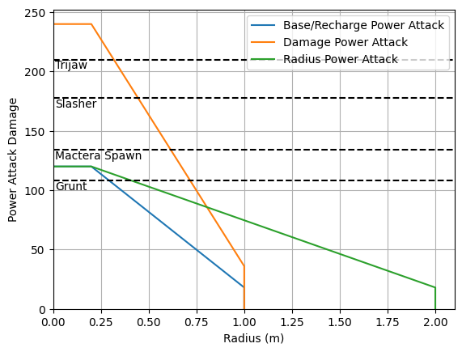

[DRG Analysis](README.md) > **Power Attack**

# Power Attack

Here's a graph showing why the damage upgrade is the best for the Power Attack:
* Damage actually has a bigger lethal radius against grunts than the radius upgrade.
* Damage is the only way for a power attack to reliably save you from a Slasher. Regular power attack can't kill one, so you have to try to roll the 50% stun chance which feels terrible.
* Damage can allow you to kill various kinds of mactera in a pinch.
* Damage makes it easier to reliably kill something with a power attack during Iron Will to activate Vampire and stay alive.
* (Not pictured) Damage technically has the highest DPS of any power attack variant, though it doesn't really matter since the power attack is rarely used immediately upon recharging.
* Damage helps chunk down Oppressors, and since the power attack is entirely AOE, it ignores Oppressor armor. Four damage power attacks will kill an oppressor, even if you dont perfectly hit inside the max damage radius.

There is an argument for taking recharge on scout to power attack the wall more often and mine minerals that way. I can see that, but I personally still take damage.

Health values shown here are for Haz 4 and above. The enemies I incleded use the common scaling, so they do not get tankier with player count or standard modded hazards of 6+.

[Back to DRG Analysis](README.md)