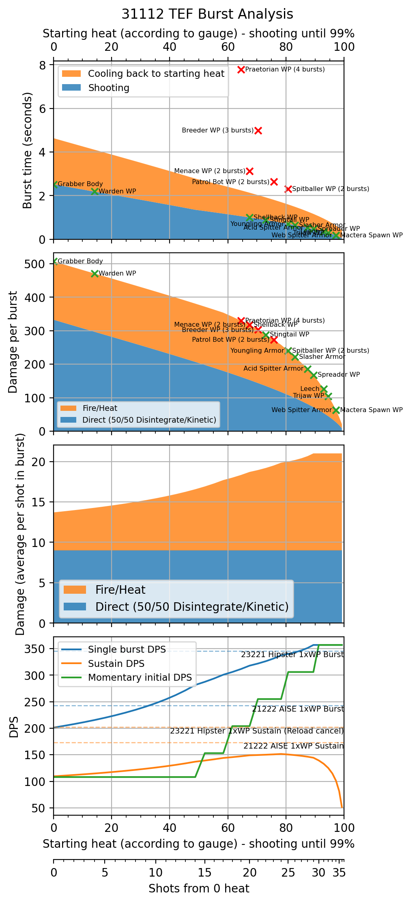
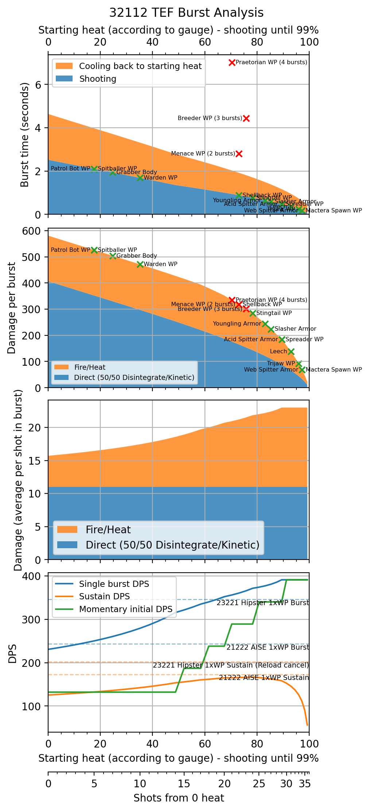
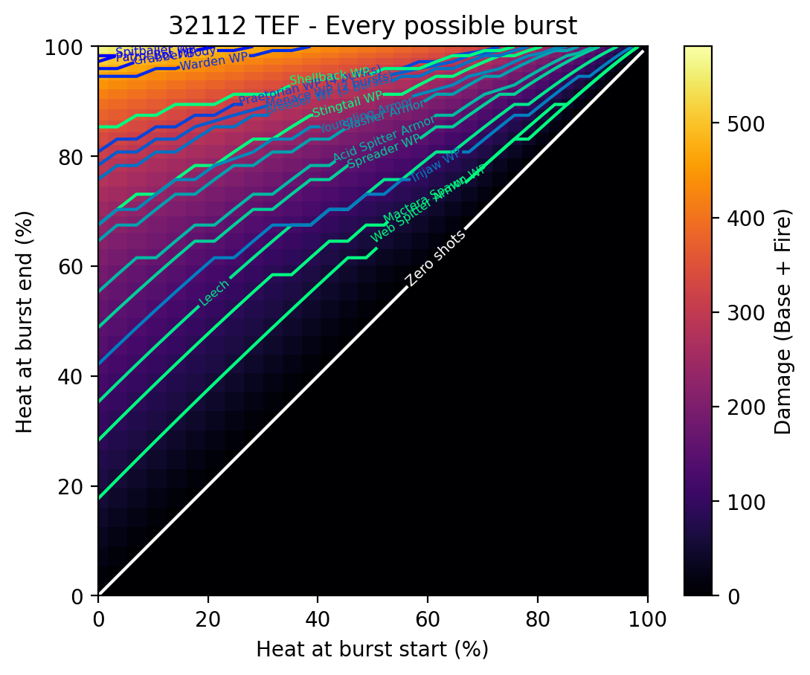
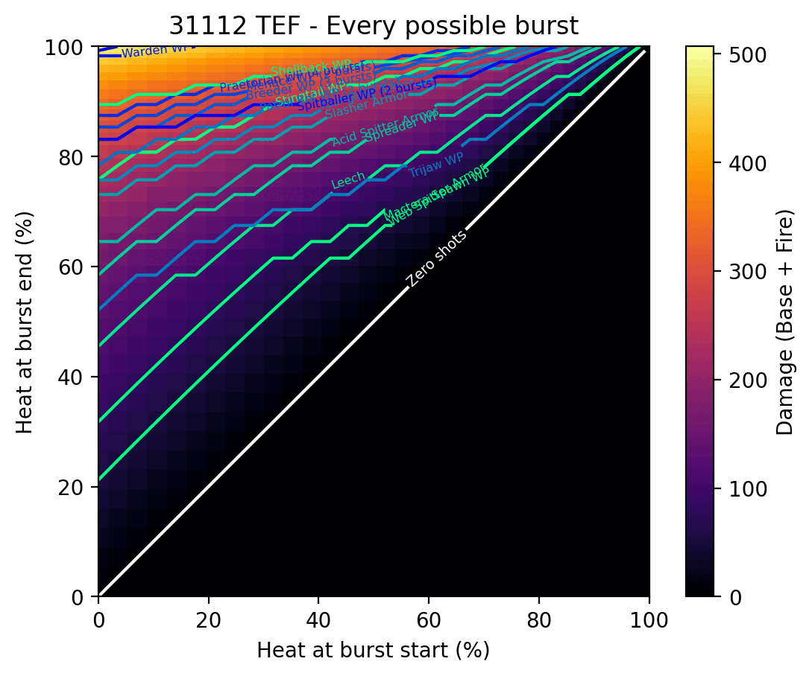

[DRG Analysis](README.md) > **TEF Analysis**

# TEF Analysis

> This is also available as [a post on r/technicaldrg](https://www.reddit.com/r/technicaldrg/comments/1c4tuan/thermal_exhaust_feedback_a_monster_in_the_third/).

## Introduction

Thermal Exhaust Feedback (TEF) is by far the strongest overclock for the Drak-25 Plasma Carbine. It offers incredible damage, ignition, electric slow/DOT, and decent accuracy when built with 3x112 - pretty much all Scout could ask for in a primary (except stun/fear - and to get armor break you have to give up the powerful electricity upgrade. Alas, we live in an imperfect world). It's not a particularly hot take to say that TEF is Scout's strongest primary option in solo modded play. Meanwhile, for modded teamplay it's a strong alternative to the M1000 Classic.

TEF's distinguishing feature is its big damage. You can shoot it at anything. [High-value targets (HVTs)](https://www.youtube.com/watch?v=Fmk4KctELMM) are traditionally Scout's focus in teamplay, but TEF does enough DPS to burst down just about any enemy, while having a pretty good ammo pool to back it up. In particular, it's much better than the M1000 at deleting tanky stationary enemies like Spitballers and Breeders.

How does it accomplish this? TEF adds increasingly large bonus Fire damage and Heat to every shot when your weapon heat exceeds 60%. At full heat, your damage is more than doubled. Therefore, the fundamental thing to understand about TEF is that it's a weapon where you want to *keep the heat high* by firing multiple bursts at enemies without cooling all the way down. Doing this successfully, without overheating or getting hit by bugs, takes practice and game sense. But, it rewards you with incredible damage output. 

The [Weapon Heat Crosshair mod](https://mod.io/g/drg/m/weapon-heat-crosshair) helps immensely with managing your heat level. It also makes it easy to estimate where important numbers like 60% and 80% heat are, with just a glance. I like to make it quite big on my screen, like a full 5 cm in diameter, to make it easier to distinguish between the highest heat percentages. But do whatever works for you.

## Build

Summary: Start with **32112**. If you play a few games and find that you want more ammo, you can move to **31112**.

### Tier 1: Rate of Fire / Less Heat per Shot / Higher Velocity

- **Rate of fire** is fine, giving better burst DPS and letting you heat up sooner, in exchange for requiring a bit more timing precision to avoid overheating. If option 3 didn't exist, this would be the next best choice.
- **Less heat per shot** is a bad match for TEF - it allows you to get longer bursts, but also makes it painfully slow to heat up into the zone where your DPS is actually good. I don't recommend this.
- **Double projectile velocity** feels great. The base drak projectile velocity is quite slow, making it difficult to track targets. Also, the slow base speed means it takes a moment for shots to reach your target, which increases time to kill and makes it easy to accidentally waste extra shots on overkilling. This upgrade increases the speed from "dismal" to "satisfactory".

I strongly recommend option 3: **faster projectiles**.

### Tier 2: Ammo / Damage

As we will see later, ammo doesn't lose many significant "breakpoints" and doesn't actually do much less DPS. However, the base ammo pool should already be plenty if you shoot judiciously (a good habit to learn for Scout in teams), and a bit extra DPS is always nice.

Start with **Damage**, but feel free to switch to **Ammo** if you find the ammo a bit tight.

### Tier 3: Accuracy / Faster Cooling / Hot Feet

- **Accuracy** decreases your spread by 70% both vertically and horizontally, resulting in a 91% smaller spread area. This significantly increases your effective range. I don't know what the base spread value is, but targets like stingtail and menace weakpoints become difficult to hit beyond 10-15 meters without this upgrade.
- **Faster cooling** is a tradeoff. You get better sustain DPS, but it becomes harder to keep the weapon hot, especially if you want to quickly reposition or snap a shot from your secondary.
- **Hot feet** makes you move faster when the weapon overheats. This has no use case with TEF, because you should not be overheating.

I strongly recommend option 1: **accuracy**.

### Tier 4: Electricity / Plasma Splash / Armor Break

- **Electricity** inflicts 135 total electric damage over 6 seconds while applying an 80% slow. This is a powerful effect - the total damage is quite hefty, and the slow is extremely useful against problem enemies like Bulks and Grabbers. The chance to apply is 15% per shot, not 20% as the equipment terminal says.
  
  | Shots                        | Chance of electricity |
  | ---------------------------- | --------------------- |
  | 4                            | 48%                   |
  | 8                            | 73%                   |
  | 14                           | 90%                   |
  | 37 (max without overheating) | 99.8%                 |
  
- **Plasma Splash** replaces 5 of your direct damage with area damage. This makes you slightly better against armor and substantially worse against weakpoints, especially when at low heat. Not very useful.
- **Armor Break** improves your armor breaking from 100% to 300% (of your base, non-fire damage). It's alright.

I recommend option 1: **electricity**.

### Tier 5: Manual Heat Dump / Faster RoF when Hot

- **Manual heat dump** lets you trigger an overheat at any time, in exchange for the overheat lasting shorter than normal. You don't want to ever overheat with TEF, because the overclock increases overheat time, and also overheating will drop you at the bottom of the heat curve where you have to heat up again to start getting good DPS. It's always better to just release the trigger and let the weapon cool to like 80% before shooting again.
- **Faster RoF when hot** is some nice extra DPS. It also gives a fun bit of audio feedback to let you know when you're approaching the toasty TEF zone.

Take option 2: **Faster RoF when hot**.

## Analysis & Usage

TEF is a weird weapon to analyze. It's tricky to think about breakpoints because it's a high rate-of-fire, low damage-per-shot weapon whose ROF and damage *also* change as you hold down the trigger. Plus, it runs into RNG effects such as spread, armor break, electricity, and On Fire damage procs. Thus, the analysis is by nature going to be a little analog and a little fuzzy. Nevertheless, by crunching some numbers and plotting some curves, we can gain useful insights into the weapon's performance and usage.

Because TEF is all about firing bursts and staying hot, I think it makes the most sense to frame the analysis around those bursts. Here, I assume a burst ends just before overheating, and I'll allow the starting heat level to vary. I'll give you some graphs where each data point measures the properties of an entire burst - not just the momentary performance at one particular heat level.

To start off, I've included plotted analysis of the 32112 and 31112 builds. Here are the plots we will use. The next few subsections will refer to them.

The plots all share the same x-axis, which is the heat level *as shown by the weapon meter* at the moment a burst starts. At the bottom, you can see how this corresponds nonlinearly to the number of shots fired due to the Drak's wacky heat scaling. As your heat meter gets higher, it will increase more slowly. The heat level is the easier thing to see and work with in game, so it's more useful to draw the graphs based on heat than something like number of shots. Incidentally, for the standard TEF build (without t1b), the number of shots scaling looks like this:

| Shot number | Milestone                               |
| ----------- | --------------------------------------- |
| 15th        | 50% heat (t5b rate of fire bonus start) |
| 18th        | 60% heat (+3 fire damage from TEF)      |
| 21st        | 70% heat (+6 fire damage from TEF)      |
| 25th        | 80% heat (+9 fire damage from TEF)      |
| 30th        | 90% heat (+12 fire damage from TEF)     |
| 38th        | Overheat                                |

### Breakpoints (Graphs 1 and 2)

Breakpoints (or burstpoints?) are tricky with TEF due to the previously mentioned random factors. In this analysis, I've calculated them numerically for Haz6p4 using the same Python script that generated the graphs. 

> **Assumptions:** The math ignores performance gained from electricity, fire DOT, and light armor getting broken. However, it also ignores performance lost to inaccuracy and imperfect heat timing, such as stopping at 95% heat versus 99% - though I actually tried that analysis and the results were basically the same.

The first plot shows the shooting time for each burst, as well as the time it would take the weapon to cool back to that initial heat value. The second shows how much damage you can get in one burst before reaching max heat. Together, this should give a decent overview of the breakpoints. The second plot really shows you how crazy TEF's heat scaling is: half of a burst's damage occurs before reaching ~77% heat, and the other half occurs after. Another way of looking at it is that going from 77% to 99% twice is equivalent to going from 0 to 99%. (Against fire-weak enemies, it's even more lopsided).

Note that breakpoints can be reached in more than one way. If you're starting from zero, you'll heat up with a long burst. Or, maybe you're not starting from zero. So, the points on the graph may not match up exactly with every situation.  But either way, once you're in that 60%+ zone, you should ideally stay in it for maximum sustain DPS. 

If you're coming from [a standard M1000 Classic focus build](https://www.reddit.com/r/technicaldrg/comments/vx1djk/build_breakdown_multichoice_scouts_m1000_classic/), there's a rule of thumb you can use to help get a sense of TEF burst size. A burst going from 80% to 99% heat is a good size to think about. It's a bit stronger than an M1000 focus shot, *after* accounting for the M1000 punching through light armor or activating its t4b weakpoint upgrade. So, if you can [kill an enemy with one focus shot](https://www.reddit.com/r/technicaldrg/comments/wgboq3/m1000_classic_breakpoints/), you can definitely kill it with an 80% burst. If it's unarmored or fire-weak, you can probably even kill it with a 90% burst.

An 80% burst is also plenty to ignite all the common [Volatile Bullets](https://www.reddit.com/r/technicaldrg/comments/vbvjuz/build_breakdown_volatile_bullets_gunners_bulldog/) targets. (Aim away from breakable weakpoints to save them for the VB shots.) Ignition breakpoints are not included in the graphs.

Notes on particular breakpoints:

- Patrol bots don't overheat in one burst, and I'm not super sure how their cooling mechanics work. In practice, TEF can kill bots by either ignition or direct damage, depending on how many shots hit the small weakpoint.
- By taking T2 ammo, the main breakpoint you lose is the 4-player Hazard 6 spitballer "one-mag". However, as long as you land most of the weakpoint shots, the baller will be finished off by electricity and On Fire ticks. If you want it dead immediately, it takes about 1 extra second to get another burst out at 90% heat.
- For breakpoints toward the left of the graph, like spitballers/grabbers/wardens, they need you to hit almost all your shots or you won't kill the enemy in one heat cycle. As mentioned in the previous bullet, missing the one-mag will only lose you ~1 second TTK, because you can finish the enemy with a second burst at 90% heat. So it's not terrible. Starting from a hot weapon, and shooting two bursts from 70%, will be more consistent than one burst from 0%.

### Efficiency (Graph 3)

The third plot shows average damage per shot in a burst. You can think of this as a measure of ammo efficiency - staying at high heat (85%+) will let you squeeze out the maximum damage from your ammo, while dipping down to 60% or lower will give more flexibility and ease of use. The amount of ammo "savings", based on the graph, looks to be roughly comparable to taking the ammo mod vs no upgrade.

### DPS (Graph 4)

The last plot shows the DPS in a single burst as well as in sustained fire (repeated bursts including cooling time). Two other popular DPS primaries are shown for comparison. Note that I'm showing weakpoint bonuses for the competitors, which TEF doesn't have, while TEF's unique bonuses against fire-vulnerable enemies are not shown. Perfect accuracy and zero overkilling are assumed (which means the Hipster stats are a bit optimistic compared to AISE, while TEF is somewhere in the middle in terms of realism).

There's a nice plateau in TEF's orange curve, indicating that if you start your bursts anywhere from 60-90% heat and go to 99%, you'll get pretty similar sustain DPS. Very short bursts at the absolute highest heat have low sustain DPS, because the gun doesn't start cooling right away, so much of your time is spent waiting to cool. (You can actually use this to maintain your heat by tapfiring one shot every 0.35 seconds until a new target shows up. It's quite ammo-efficient, though perhaps not the best use of your time.)

The other notable finding from this graph is that despite TEF's performance jumping in intervals of 10% heat, its overall burst DPS curve (blue) is very smooth - there is no need to keep track of where exactly the bonuses trigger, or to micromanage those thresholds.

The green curve is the *only* thing in this entire graph series that shows TEF's performance at one instant, as opposed to over an entire burst. 

### Bonus: All Possible Bursts

This extra plot shows the damage done by every possible burst, as defined by starting and ending heat percentage. You can also see which bursts hit various breakpoints. Again, it's insane how quickly things die when your weapon is hot. By comparing the graphs, notice that the damage and ammo builds only tend to differ by 1 or sometimes 2 shots for most HVTs.

### Quirks

Some testing has revealed a few extra things about TEF that the graphs didn't:

- Only the base drak part of the damage counts toward breaking weakpoints. The fire portion of the damage, which is often half or more of the total, will get weakpoint bonuses without breaking the weakpoint. Volatile Bullets bulldog has very similar behavior, dealing massive damage to Bulk Detonators while not immediately popping their blisters. This likewise makes TEF a decent source of damage against breakable weakpoints, especially if you stay at high heat and/or take the ammo mod. Do be careful though, because it's still easy to pop Goo Bomber and Menace weakpoints before they ignite, which means your gunner will have a harder time VBing them. If your goal is ignition, aim for the body.
- The bonus fire damage does not count toward breaking heavy armor. TEF feels pretty bad against armored enemies with t4a, and this goes some distance toward explaining why. It's not the end of the world, but it sure would be nice to have an instant answer to stingtails and similar enemies. In solo, 12233 Double Barrel boomstick will absolutely delete them in one click. Or, you can use Shaped Shells boomstick with tier 4 armor break, which works great in teams too.

## Summary and Key Insights

- Shoot in bursts while keeping the weapon hot.
- Because of the time to heat up, TEF rewards somewhat longer sequences of shooting rather than grapple-hopping around to pop only one or two enemies at a time. That, plus the lack of stun/fear, makes it a bit less safe to use than the M1000, but in return, it hits harder and dishes out plenty of utility.
- For best sustained DPS, start your bursts anywhere from 60-90% heat. 
	- Going somewhat lower than 60% is almost as good. 
  - Bursts covering less than 10% of your heat meter actually give much lower overall DPS, because a lot of time is spent cooling. (In the extreme, tapfiring single shots is a surprisingly ammo-efficient way to maintain heat.)
	- Start at 80% to get slightly better ammo efficiency while still keeping the same sustain DPS.
- Squishy HVTs will be thoroughly killed by one burst starting at 80% heat with either build, and common VB targets will be ignited. And are very likely to be slowed by electricity.
- Two bursts starting at 80% heat do about the same damage as one full magdump from 0%, in almost the exact same time.
- Breakpoints are similar regardless of T2 ammo/damage choice, except for the 4p spitballer one-mag.
- Don't overheat unless that last bullet is worth spending more than 3 seconds cooling. And ending up with a cold weapon.

PS: I couldn't figure out where to best put this note, but if you do happen to overheat, you can start shooting again at the _beginning_ of Scout's "slap gun with the other hand" animation - you don't have to wait for the end of the animation. 

## Python script

The code I used to generate the graphs is provided [here](https://gist.github.com/samuelxyz/f3f857f53f3c7bc8cb50f96220310801). If you want to analyze other builds, or add/tweak/fix anything about the graphs, this will hopefully make it easy to do so.

If you don't have a Python environment set up, you can still run this in an online service such as [Google Colab](https://colab.research.google.com). 

The first two non-commented lines allow you to change (1) the build and (2) the amount of heat that the calculation will stop all bursts at. (The latter is so you can account for having skill issue like an actual human, and not firing right until the last possible shot. However, the result seems to be about the same whether you stop at 99% or 93%.)
## Comment responses

> ### What secondary/nades do you recommend for this?

TEF works well with just about any standard scout loadout. The Boomstick and the Boltshark are the preferred secondaries in modded games due to their utility and quick application, while Zhukovs mostly just provide a source of close range DPS which is not considered as valuable. Boomstick and Boltshark both provide a quick source of stun, which can help fill in for TEF's lack of it. 

**In solo games**, 12233 Double Barrel boomstick is a strong tool for close up group bug clear. IFGs or pheromones tend to complete the loadout, since they clump up bugs which increases Double Barrel value. Fire Bolts are also a strong solo choice, offering easy fire spread for swarm clear.

**In team games**, most grunt clear can be offloaded to the rest of the team. So, you don't really need the short-range grunt obliteration of Double Barrel, or the slow fire application of Fire Bolts. Instead, the more common secondary choices tend to be various longer range options:

- [Other Boomstick builds](https://www.reddit.com/r/technicaldrg/comments/1c4txtr/build_breakdown_scouts_juryrigged_boomstick/) pair well with TEF, and 11323 Shaped Shells is particularly noticeable. It helps with stun and armor break, which are weaknesses of TEF, while supplementing long range ignition. 
- [Cryo Bolts](https://www.reddit.com/r/technicaldrg/comments/y5k67f/cryo_bolts_breakpoints_and_an_interesting_bug/) are the other common secondary. TEF is already pretty good at killing stationary enemies like Spitballers, which tend to be major targets of Cryo Bolts. Plus, fire and cryo counteract each other, so you do have to avoid shooting a hot TEF drak at cryo'd enemies. So TEF isn't as good of a synergy with Cryo Bolts as other primary options, but I do hear of people using them together. And Cryo Bolts are just very strong generally, so you still end up with a powerful loadout.

**Common grenade options** are IFGs and Cryos, which basically work the same as with any other loadout. Pheromones are also very strong, but less common in teams because they seem to have a stigma of being too powerful. (Lol)

> ### Thoughts on the particle accelerator oc? It has been my personal favorite for the drak

Good question, thanks for asking!

**OPA (Overtuned Particle Accelerator)** has burst damage roughly comparable to a not-very-well-heat-managed TEF, depending on the exact OPA build. It would be quite good, except that the spread is so wide you can barely hit anything. I guess you could use it to shoot praetorian weakpoints at point blank range, but for that job you probably want Hipster instead, which beats OPA in both burst and sustain DPS if you reload cancel. Plus Hipster can hit things at long range and has armor break and the tier 5 upgrades on demand.

**SBB (Shield Battery Booster)** is the other Drak competitor in terms of DPS. It has good burst damage, but pretty iffy sustain because of the heat penalties. It does help significantly with staying alive because of the shield regen buff, but if you use it for that purpose then you're not at full shields. And if you're not at full shields, SBB is even worse damage than base Drak. There are so many sources of chip damage in modded that SBB is not really taken much.

Here's a comparison table (hopefully my math is right):

| Build         | Burst DPS | Sustain DPS | Notes                               |
| ------------- | --------- | ----------- | ----------------------------------- |
| 32102 OCless  | 161       | 95          |                                     |
| 32102 TEF     | 231       | 125         | From 0% heat (badly used)           |
| 32102 TEF     | 340       | 162         | From 60% heat                       |
| 32102 TEF     | **374**   | 166         | From 80% heat                       |
| 22202 OPA     | 278       | **181**     | Unga bunga max damage build         |
| 21102 OPA     | 249       | 139         | ammo + "accuracy" build             |
| 22202 SBB     | 259       | 126         | Full cooling build, shields up      |
| 22102 SBB     | 259       | 101         | Accuracy build, shields up          |
| 21222 AISE    | 243       | **173**     | Hitting 1x weakpoint                |
| 23221 Hipster | **346**   | **202**     | Hitting 1x weakpoint, reload cancel |

[Back to DRG Analysis](README.md)