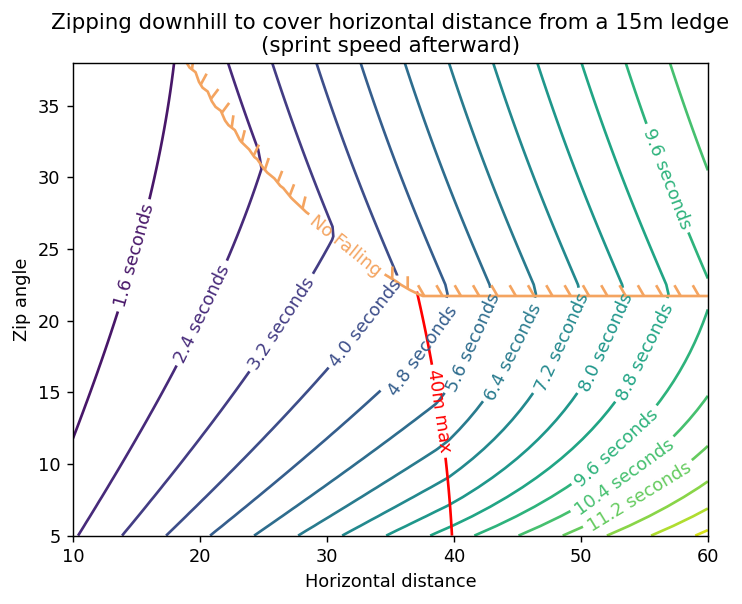
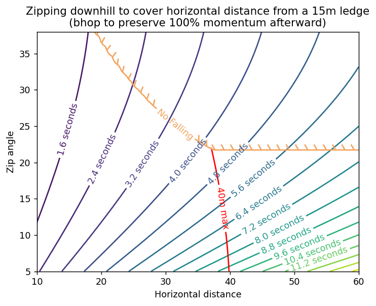

[DRG Analysis](README.md) > **Zipline Analysis**

# Zipline Analysis

When considering the gunner's zipline launcher, there are a few different aspects one might find interesting:
* Strategy
  * Zip camping to avoid melee aggro and draw ranged aggro
  * (slow) upward traversal
  * zipping down as a way to breach into new caves
  * zipping down tunnels to go faster
  * zipping as a pseudo-dash in combat
  * saving fall damage (why I always advocate dumping any extra zipline ammo in a random direction before resupplying if the resup isn't super urgent)
  * getting cornered on a ledge and escaping by placing a zipline to the floor except you tried to grab the zipline before it was grabbable and you realize you just jumped off the cliff like a fool
* Build tree: 
  * Tier 1 ammo (for more frequent usage) vs angle (for usability in more situations)
  * Tier 3 speed (for going up much faster) vs fall damage reduction (for bugged fall damage reduction that lasts until you die)
* The technique where you hold forward and spam jump and E to rapidly ascend a zipline and avoid being knocked down (by far most effective as host or solo, mid or bad as client)
* Optimal placement angle for covering horizontal distance as fast as possible

Here I will just focus on the last of those topics. I may add more thoughts about the other points at a later time.

## Horizontal traversal

When you are going downhill on a zipline (with an angle of at least 5 degrees), you can boost your speed along the zipline by holding the [Forward] button (usually `W`). The boost is bigger if the zipline is steeper. It lasts as long as you hold the forward button.

Picture the following situation: You are standing on slightly high ground. You would like to move a large horizontal distance forward as quickly as possible. A zipline is a great way to do this. But at what angle should you place the zip? Should you go as steep as possible for maximum speed, knowing that you will eventually reach the ground and have to walk? Or should you zip the whole way, getting less speed but maintaining that speed all the way to the finish?

(Yes, this is mostly a micro-optimization and the difference is ultimately a couple of seconds at best. However, it was interesting so I wanted to make a graph. No I don't have a problem, I can quit whenever i want)

Here we go:

This graph may be a bit hard to read. Start at the bottom edge. Pick a particular horizontal distance, any horizontal distance you like. Then go vertically upward until you encounter the contour with the smallest number of seconds. That's the optimum zip setup for that distance.

Let me explain more about this graph.

There are 3 main zones in this graph, which are separated by the brown line and the red line.
* Bottom left: The zipline overshoots your desired horizontal distance. By the time you have travelled horizontally that distance, you are still on the zipline. You'll have to hop off and fall to the ground. Obviously making the zipline steeper will allow you to travel that distance faster, and the graph agrees: at any point in this zone, if you move vertically upward on the plot, you find a lower number of seconds to make the trip.
* Top right: The zipline reaches the ground before you have gone the whole distance. You'll have to sprint to the finish line afterward. In this zone, the time contours tilt the other way, meaning that shallower zipline angles are actually better. As it turns out, even a shallower zipline is still faster than sprinting, so you're better off covering as much distance as you can with that zipline.
* Bottom right: The zipline is only 40m long, and ends in midair. Upon reaching the end, you have to fall through the air and then hit the ground and sprint to the finish. I did not include the delay caused by falling. How did you even place this zipline? You probably don't need to dedicate any brain cells thinking about this zone

There are 2 special lines on this graph, which are the brown line and the red line.
* Brown "No Falling" line: In the zone above this line, the zipline reaches all the way to the ground. Hence, there is no falling involved. Below this line, the zipline either overshoots your landing point, or isn't long enough and ends in midair. See how the brown line levels out toward the right? I've started you out with 15 meters of vertical high ground, and that line levels out at the angle where the zipline just barely reaches the ground at its 40m max length. (The precise angle is `arcsin(15/40) = 22.02 deg` in this case)
* Red "40m max" line: To the left of this line, your zipline reaches all the way to the ground but it's after you've already accomplished your desired horizontal travel. To the right of this line, the zipline is too short to reach the ground at all, and ends in midair.

There is definitely some error in this graph:
* For one thing, when you hop on a zipline and press w, you don't immediately reach the full speed. But the acceleration is fast enough that I didn't bother accounting for it, and I don't know the acceleration profile anyway.
* For another thing, you may be a dwarf but you still have some nonzero height, and your feet will touch the ground before you actually reach the end of the zipline.
* Also, people tend to hop off the zipline before they actually reach the ground, maintaining some momentum before settling into a sprint. I did not account for this extra speed.
* You may have taken the speed upgrade in tier 3 (I certainly do) which slightly increases your speed. However, it's not a big enough upgrade to change any of the conclusions for going downhill; you mainly notice this when going uphill. I did not account for the speed upgrade in this graph, though I did try adding it in just to see if it made any noticeable difference. That's how I know it does not.
* I have specifically drawn this graph for 15m of initial vertical height. If you are higher up, the brown line will be higher up and the red line will be longer. If the opposite, then the opposite. This should not change the conclusions, just the size of each zone. However, that bottom right zone does have a lot of curvature and if it gets big enough, the lines start curving in the other direction meaning there is an optimum angle that is not just "be as steep as possible". However, it should be rare that you find yourself in this zone, so just forget I said anything.

### Conclusions

It turns out the optimum at each distance follows the edge of the "No Falling" zone that I have helpfully outlined with the brown line. This means that if you want to travel fast horizontally, zip directly to where you want to go. If the zipline isn't long enough, make it as shallow as you can while still reaching the ground at the end. But do keep at least 5 degrees of steepness so you can get the speed boost.

However, there's a tricky tradeoff. What if you want to go back *up* the zipline later? If you don't boost by pressing w downhill, ziplines move you at a constant speed regardless of their angle. Thus a steeper zipline is just always better for going uphill. And going uphill is soooo slow on a zipline that any time savings you get from optimizing for downhill travel will be more than wiped away by that longer uphill climb later. So then:
* If you think you're unlikely to go back up the zipline later in a time-sensitive manner, use a shallow zip to cover distance while you're going downhill. This may happen if driller makes a tunnel up the cliff which is just always better for going uphill. Or if for whatever reason you will go uphill later but you know it won't be urgent, you can also use a shallow zip to optimize for downhill.
* If you really need that downhill distance *right now* and it's more important than some nebulous hypothetical later uphill, then use a shallow zip.
* If you're going to go up this zipline multiple times in the future, probably use a steep zip. You can cope with taking an extra 1.5 seconds or whatever it is on the downhill part.

### But what if you bhop?

Bhopping in this game requires approximately frame perfect-jump inputs and a high enough framerate. Understandably, those are difficult to pull off. But if you do it (using an unlocked scroll wheel or a mod), you get to keep all that forward speed that you got from the zipline. So how does the conclusion change?

Well, this case is simpler. The time contours all tilt the same way everywhere. Just make the zip as steep as you can. Go fast downhill and go fast uphill. The end.

[Back to DRG Analysis](README.md)